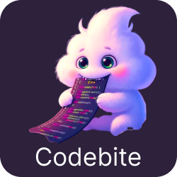
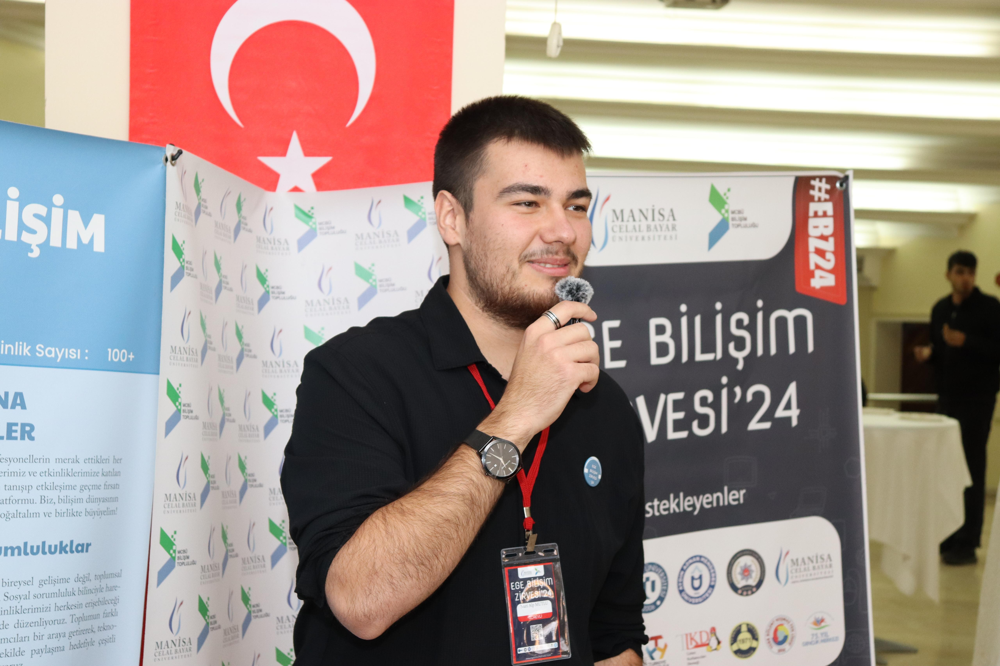
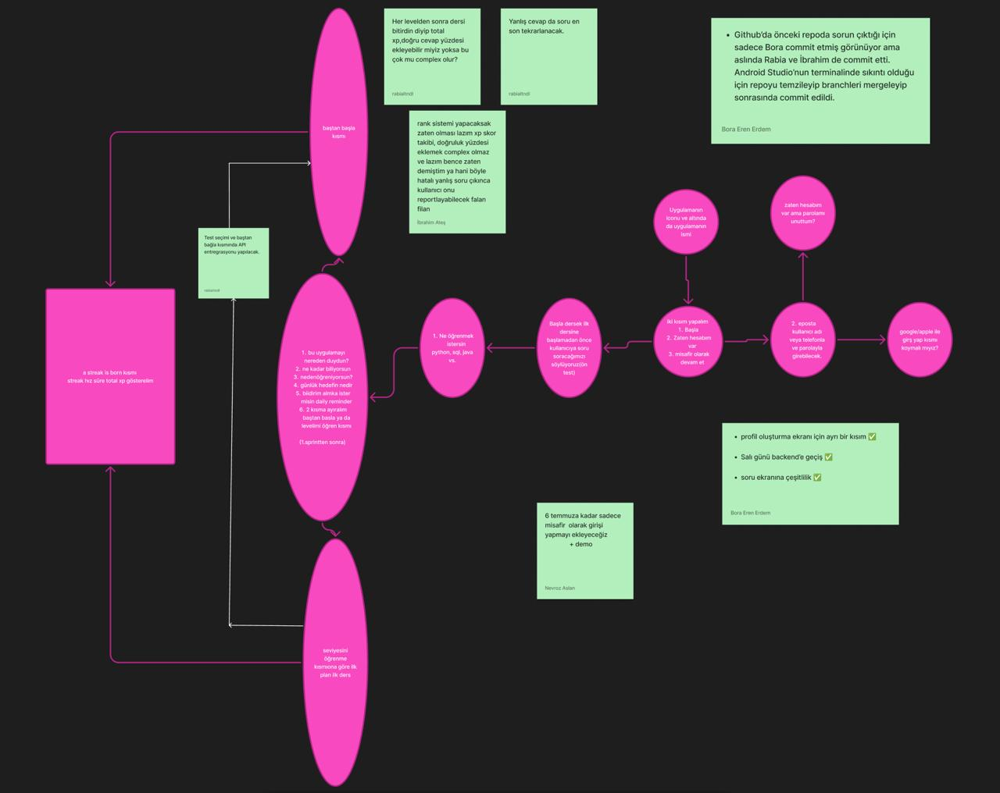
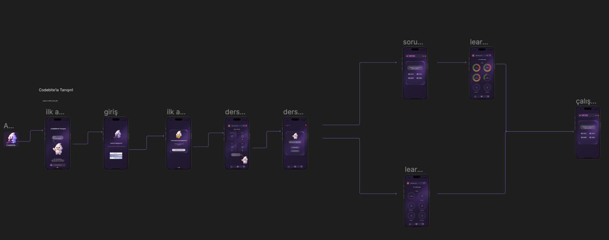
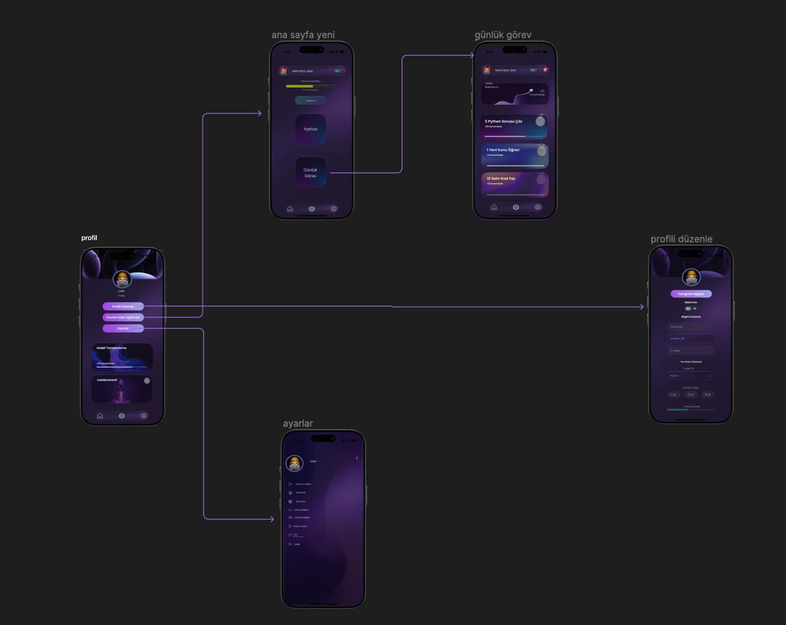

# Takım İsmi
Bootcamp Grup 95

---

## Takım Üyeleri

<table>
  <thead>
    <tr>
      <th> </th>
      <th>Name</th>
      <th>Title</th>
      <th>Socials</th>
    </tr>
  </thead>
  <tbody>
    <tr>
      <td></td>
      <td>İbrahim Ateş</td>
      <td>Product Owner</td>
      <td></td>
    </tr>
    <tr>
      <td></td>
      <td>Rabia Altundal</td>
      <td>Scrum Master</td>
      <td></td>
    </tr>
    <tr>
      <td></td>
      <td>Bora Eren Erdem</td>
      <td>Developer</td>
      <td></td>
    </tr>
    <tr>
      <td></td>
      <td>Nevroz Aslan</td>
      <td>Developer</td>
      <td></td>
    </tr>
    <tr>
      <td></td>
      <td>Nuri Alp Mutlu</td>
      <td>Developer</td>
      <td></td>
    </tr>
  </tbody>
</table>

---

## Uygulama İsmi
*Codebite*

---

## Product Backlog URL
[Product Backlog'a buradan ulaşabilirsiniz](https://www.notion.so/21082b3b80e880f8aea3fd648c8885c0?v=21b82b3b80e880ee90be000cad4b371c)

---

## 📱 Uygulama Açıklaması
*CodeBite – Yazılımı Isırık Isırık Öğren!*

CodeBite, yazılıma sıfırdan başlayanlar için özel olarak tasarlanmış, yapay zekâ destekli interaktif bir öğrenme platformudur. Kısa ve anlaşılır görevlerle temelden başlayarak, oyunlaştırma teknikleriyle öğrenme sürecini eğlenceli ve etkili hale getirir. Akıllı yönlendirmeler ve kişiselleştirilmiş içeriklerle herkesin kendi hızında ve seviyesinde ilerlemesini sağlar. Kod yazmayı bir yük değil, bir keşif yolculuğuna dönüştürür.
CodeBite ile yazılım öğrenmek artık daha kolay, eğlenceli ve erişilebilir.

*🎯 Misyon*

CodeBite'ın misyonu, yazılım öğrenimini herkes için erişilebilir, anlaşılır ve keyifli hale getirmektir. Teknolojiyle yeni tanışan bireylerin önündeki karmaşıklık ve korkuyu ortadan kaldırarak, onları güçlü ve motive edici bir öğrenme yolculuğuna çıkarmayı hedefler.

---

## Uygulama Özellikleri:

- 🤖 Yapay Zekâ Destekli İlerleme: Yapay zeka ile seviye belirleme ve seviyene göre oluşturulmuş sorular.

- 🧩 Oyunlaştırılmış Görevler: Öğrenmeyi eğlenceli kılan, seviye seviye ilerleyebileceğin mini görevler.

- 🧠 Temelden Kodlama Dilleri: Algoritmalar, Python, C# ve JavaScript gibi dillerde kolay anlaşılır içerikler.

- 🎯 Kişiselleştirilmiş Öğrenme Yolu: Hedeflerine ve hızına göre şekillenen, tamamen sana özel bir öğrenme deneyimi.

Yazılıma adım atmak hiç bu kadar kolay olmamıştı. *İlk ısırığını al, CodeBite ile kodlamaya başla!*

---

## 🎯 Hedef Kitle

- 15–25 yaş arası öğrenciler
- Yazılıma ilgi duyan ama nereden başlayacağını bilmeyenler
- Eğitim kurumları / Kodlama kulüpleri
- Üniversite hazırlık / lise öğrencileri
- Kariyer değiştirmek isteyen yetişkinler

---

## Daily Scrum

- Sprint içinde tamamlanması tahmin edilen puan: 350 Puan
- Puan tamamlama mantığı: Toplamda proje boyunca tamamlanması gereken 350 puanlık backlog bulunmaktadır. 3 sprint'e bölündüğünde ilk sprint 100, ikinci sprint 200 ve üçüncü sprint 150 olmasına karar verildi.
- Daily Scrum: Bootcamp’in gününden beri günde en az bir kere zaten toplantı yapmakla beraber bu iki haftalık süreçte genelde günde iki toplantı yapıyorduk. İlk toplantıda o gün ne yapacağımızı konuşurken akşamki toplantıya kadar görevlerimizi yapmış oluyorduk. Gün içinde Whatsapp grubumuzdan karşılaştığımız sorunları ve fikir alışverişini yaparken [Notion](https://www.notion.so/Daily-Scrum-21d82b3b80e880cdb404e33998104b38) üzerinden de görev dağılımı ve daily scrum’ın takibini yaptık.
- [Daily Scrum](https://www.notion.so/Daily-Scrum-21d82b3b80e880cdb404e33998104b38)

---

# Sprint 1

---

## Sprint Notları:

- İlk sprintte figmadan uygulamanın tasarımının oluşturulması, ‘learning path’ sayfasına kadar da front-end kısmının bitirilmesine karar verildi.

- Proje yönetimi ve zaman çizelgesi için Notion kullanıldı.

- UI ve userflow oluşturmak için Figma kullanıldı.

- Kullanıcı girişi için misaifir girişi oluşturduk.

- Front-End kısmı için flutter kullanmaya karar verdik.

---

## Sprint Review

[Figma Sayfamız](https://www.figma.com/design/Z4ecMTd5l7ImfNgZhS8Bgz/codebite?node-id=0-1&p=f&t=E1Le1psq5lt68imt-0)

İlk hafta grup olarak uygulamamızda hangi bölümlerin, hangi sayfaların olması gerektiğine, yapay zekayı hangi kısımda nasıl kullanacağımıza karar verdik.

Konuştuğumuzun kısımları bir userflow diyagramına dönüştürerek oluşturmamız gereken sayfaları adım adım yazdık.

Oluşturduğumuz diyagramdaki düzeni takip ederek sayfa sayfa figma üzerinden ilk tasarımlarımızı oluşturduk.

Aldığımız ortak kararla uygulama ismine CodeBite vererek bu isme uygun maskotumuzu da belirledik.

İkinci hafta Figmadan ilk kısımları oluşturduktan sonra ikiye bölündük. Bora ve Nevroz Figma tasarımlarının devamını yapıp bitirdikten sonra Backend tarafına geçiş yapacakken, İbrahim ve Rabia’nın front-end kısmına başlamasına karar verildi.

Front-end için android studio üzerinden flutter kullanmaya karar verdik.

Tasarımlarımızı ilk halinden şu an kullanılan şık haline getirdik. Oluşan son tasarımın üzerinden de Front-end olarak ilk 10 sayfayı tamamladık.

Codebite uygulamamızı .apk olarak test ettik ve geliştirmemiz gereken taraflarını gözlemledik.

Sprint Review'a Katılanlar: İbrahim Ateş, Rabia Altundal, Bora Eren Erdem, Nevroz Aslan, Nuri Alp Mutlu

## Sprint Retrospective:

Bu sprintte Front-End geliştirme için Android Studio kullanmaya karar verdik. Ancak kurulum süreci tahmin ettiğimizden daha zorluydu. İki haftalık süreçte çeşitli sorunlarla karşılaşsak da, uzun uğraşlar sonunda başarılı bir şekilde kurulumumuzu tamamladık.

Tasarım sürecinde ise, ekip olarak ilk kez kullandığımız Figma'yı oldukça hızlı bir şekilde öğrenip etkin bir şekilde kullanabildik. Kafamızdaki fikirleri somutlaştırmak konusunda bize büyük kolaylık sağladı.

Takım içi iletişim açısından ise; toplantılarımızı verimli geçirmeyi başardık ve birbirimizi eksik olduğumuz noktalarda destekleyerek uyumlu bir şekilde çalıştık.

Yapay zekayı nasıl kullanacağımıza 2.sprintte karar verilecek.

## ---- 1. Sprint Backend Raporu ----

### 1. Sprint Hedefleri

- FastAPI tabanlı bir backend oluşturmak.

- Kullanıcı yönetimi (kayıt, giriş, yetkilendirme) için endpoint’ler geliştirmek.

- Ders ve ilerleme yönetimi için endpoint’ler oluşturmak.

- SQLite veritabanı ile SQLAlchemy entegrasyonunu tamamlamak.

- Admin ve user yetkilendirmesi yapmak.

- Git reposunu temiz ve düzenli bir şekilde yapılandırmak, .gitignore ile gereksiz dosyaları yoksaymak.

- Flutter entegrasyonuna hazırlık yapmak için API’nin temel işlevselliğini tamamlamak.

### 1. Sprint Tamamlanan Hedefler

#### a) Backend Altyapısı:

- requirements dosyası oluşturdu. -> Tamamlandı

- main.py dosyasında FastAPI uygulaması oluşturuldu. Çeşitli ve temel yapılandırmalar yapıldı. Uvicorn kullanıldı. -> Tamamlandı

- SQLite veri tabanı tercih edildi ve codebite.db ile SQLAlchemy ile bağlantı kuruldu. Görüntüleme olarak şimdilik DBeaver kullanıldı. -> Tamamlandı

- Veritabanı bağlantısı ve oturum yönetimi için database.py oluşturuldu. -> Tamamlandı

- models.py dosyasında User, Lesson ve Progress modelleri SQLAlchemy ile tanımlandı ve oluşturuldu. -> Tamamlandı

- schemas.py dosyasında çeşitli API verilerini doğrulamak için Pydantic modelleri (UserRegister, Lesson, Progress, vb.) oluşturuldu. -> Tamamlandı

#### b) API Endpoint’leri:

- Kullanıcı kayıt ve giriş endpointleri geliştirildi. -> Tamamlandı

- JWT tabanlı yetkilendirme (OAuth2) yapıldı ve uygulamanın güvenliği arttırıldı. Bu kısımda schemas.py ve models.py dosyalarındaki classlar ile OAuth2Bearer kısmında sorun çıksa da en sonunda hata bulundu ve fixlenip JWY entegrasyonu başarıyla tamamlandı. -> Tamamlandı

- Admin ve userlar için rol tabanlı yetkilendirme eklendi. -> Tamamlandı

- Ders oluşturma, ders listeleme, ders seçme, kullanıcı derslerini görme ve yetki filtrelemesi yapıldı. -> Tamamlandı

- Progress barları yönetme ve güncelleme yapıldı. -> Tamamlandı

- Admin endpointleri ile user endpointlerine yetki ayrımı ve çeşitli geliştirmeler yapıldı. Admin ve user yetkilendirmelerinde hata alınsa da hata fixlenerek başarıyla tamamlandı. -> Tamamlandı

#### c) Github:

- .gitignore dosyası oluşturuldu ve görüntülenmesi istenmeyen dosyalar gizlendi.

- Dosyalar ayrı ayrı commit edilip her biri için açıklayıcı mesajlar kullanıldı.

- Frontend kısmındaki Flutter ile daha entegre olmadığından ve backend kısmında developerlar olarak daha rahat hareket etmek istenildiğinden main branch yerine master branch'e push edildi. İleride bu branchlerin mergelenmesi planlandı.

**1.Sprint için backend tamamlandı. Flutter entegrasyonu ve backend geliştirme için hazır hale getirildi.**

### 2.Sprint İçin Hedefler:

- Flutter entegrasyonu

- Backend işlemleri detay geliştirme

- Gemini AI entegre ve prompt engineering

- Gemini AI ile kullanıcı seviye tespitine göre AI ile otomatik soru ve oluşturma

- Github'ın düzenli olarak güncellenmesi