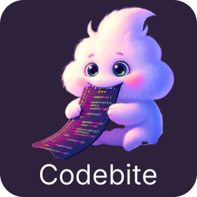

# Takım İsmi  
Bootcamp Grup 95 

---

## Takım Üyeleri

- **_İbrahim Ateş_** – Product Owner
- **_Rabia Altundal_** – Scrum Master
- **_Bora Eren Erdem_** – Developer
- **_Nevroz Aslan_** – Developer  
- **_Nuri Alp Mutlu_** – Developer  

---

## Uygulama İsmi
**Codebite**

---

## Product Backlog URL  
[Product Backlog'a buradan ulaşabilirsiniz](https://www.notion.so/21082b3b80e880f8aea3fd648c8885c0?v=21b82b3b80e880ee90be000cad4b371c)

---

## Uygulama Açıklaması
**CodeBite – Yazılımı Isırık Isırık Öğren!**

CodeBite, yazılıma sıfırdan başlayanlar için tasarlanmış, yapay zekâ destekli interaktif bir öğrenme platformudur. Öğrenme sürecini eğlenceli, sade ve etkili hale getirerek programlamayı herkes için ulaşılabilir kılar. Kısa görevlerle temelden başlayarak, oyunlaştırma ve akıllı yönlendirmelerle seni yazılım dünyasına adım adım hazırlar.

---

## Uygulama Özellikleri:

🤖 Yapay Zekâ Destekli İlerleme: Yapay zeka ile seviye belirleme ve seviyene göre oluşturulmuş sorular. 

🧩 Oyunlaştırılmış Görevler: Öğrenmeyi eğlenceli kılan, seviye seviye ilerleyebileceğin mini görevler.

🧠 Temelden Kodlama Dilleri: Algoritmalar, Python, C# ve JavaScript gibi dillerde kolay anlaşılır içerikler.

🎯 Kişiselleştirilmiş Öğrenme Yolu: Hedeflerine ve hızına göre şekillenen, tamamen sana özel bir öğrenme deneyimi.

Yazılıma adım atmak hiç bu kadar kolay olmamıştı. **İlk ısırığını al, CodeBite ile kodlamaya başla!**

---

## Hedef Kitle:
- Yazılımı hiç bilmeyen ama öğrenmek isteyen herkes.
- Kendi kendine kod öğrenmeye çalışanlar
- Kariyerini teknolojiye yönlendirmek isteyenler

- CodeBite, yazılıma sıfırdan başlamak isteyen gençler ve kariyerini teknolojiye yönlendirmek isteyen herkes için tasarlanmıştır.