# Takım İsmi
**Bootcamp Grup 95**

---

## Takım Üyeleri

<table>
  <thead>
    <tr>
      <th> </th>
      <th>Name</th>
      <th>Title</th>
      <th>Socials</th>
    </tr>
  </thead>
  <tbody>
    <tr>
      <td></td>
      <td>İbrahim Ateş</td>
      <td>Product Owner</td>
      <td></td>
    </tr>
    <tr>
      <td></td>
      <td>Rabia Altundal</td>
      <td>Scrum Master</td>
      <td></td>
    </tr>
    <tr>
      <td></td>
      <td>Bora Eren Erdem</td>
      <td>Developer</td>
      <td></td>
    </tr>
    <tr>
      <td></td>
      <td>Nevroz Aslan</td>
      <td>Developer</td>
      <td></td>
    </tr>
    <tr>
      <td>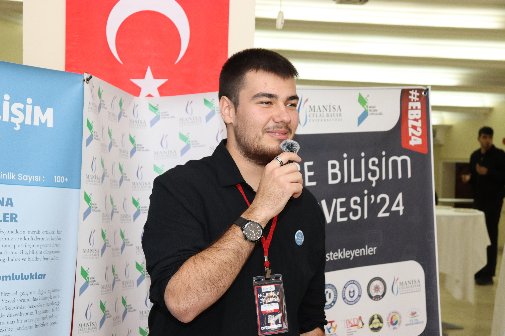</td>
      <td>Nuri Alp Mutlu</td>
      <td>Developer</td>
      <td></td>
    </tr>
  </tbody>
</table>

---

## Uygulama İsmi
*Codebite*

---

## Product Backlog URL
[Product Backlog'a buradan ulaşabilirsiniz](https://www.notion.so/21082b3b80e880f8aea3fd648c8885c0?v=21b82b3b80e880ee90be000cad4b371c)

---

## 📱 Uygulama Açıklaması
*CodeBite – Yazılımı Isırık Isırık Öğren!*

CodeBite, yazılıma sıfırdan başlayanlar için özel olarak tasarlanmış, yapay zekâ destekli interaktif bir öğrenme platformudur. Kısa ve anlaşılır görevlerle temelden başlayarak, oyunlaştırma teknikleriyle öğrenme sürecini eğlenceli ve etkili hale getirir. Akıllı yönlendirmeler ve kişiselleştirilmiş içeriklerle herkesin kendi hızında ve seviyesinde ilerlemesini sağlar. Kod yazmayı bir yük değil, bir keşif yolculuğuna dönüştürür.
CodeBite ile yazılım öğrenmek artık daha kolay, eğlenceli ve erişilebilir.

*🎯 Misyon*

CodeBite'ın misyonu, yazılım öğrenimini herkes için erişilebilir, anlaşılır ve keyifli hale getirmektir. Teknolojiyle yeni tanışan bireylerin önündeki karmaşıklık ve korkuyu ortadan kaldırarak, onları güçlü ve motive edici bir öğrenme yolculuğuna çıkarmayı hedefler.

---

## Uygulama Özellikleri:

- 🤖 Yapay Zekâ Destekli İlerleme: Yapay zeka ile seviye belirleme ve seviyene göre oluşturulmuş sorular.

- 🧩 Oyunlaştırılmış Görevler: Öğrenmeyi eğlenceli kılan, seviye seviye ilerleyebileceğin mini görevler.

- 🧠 Temelden Kodlama Dilleri: Algoritmalar, Python, C# ve JavaScript gibi dillerde kolay anlaşılır içerikler.

- 🎯 Kişiselleştirilmiş Öğrenme Yolu: Hedeflerine ve hızına göre şekillenen, tamamen sana özel bir öğrenme deneyimi.

Yazılıma adım atmak hiç bu kadar kolay olmamıştı. *İlk ısırığını al, CodeBite ile kodlamaya başla!*

---

## 🎯 Hedef Kitle

- 15–25 yaş arası öğrenciler
- Yazılıma ilgi duyan ama nereden başlayacağını bilmeyenler
- Eğitim kurumları / Kodlama kulüpleri
- Üniversite hazırlık / lise öğrencileri
- Kariyer değiştirmek isteyen yetişkinler

---

## Daily Scrum

- Sprint içinde tamamlanması tahmin edilen puan: 600 Puan
- Puan tamamlama mantığı: Toplamda proje boyunca tamamlanması gereken 600 puanlık backlog bulunmaktadır. 3 sprint'e bölündüğünde ilk sprint 100, ikinci sprint 200 ve üçüncü sprint 300 olmasına karar verildi.
- Daily Scrum: Bootcamp’in gününden beri günde en az bir kere zaten toplantı yapmakla beraber bu iki haftalık süreçte genelde günde iki toplantı yapıyorduk. İlk toplantıda o gün ne yapacağımızı konuşurken akşamki toplantıya kadar görevlerimizi yapmış oluyorduk. Gün içinde Whatsapp grubumuzdan karşılaştığımız sorunları ve fikir alışverişini yaparken [Notion](https://www.notion.so/Daily-Scrum-21d82b3b80e880cdb404e33998104b38) üzerinden de görev dağılımı ve daily scrum’ın takibini yaptık.
- [Daily Scrum / Sprint 1](https://www.notion.so/Daily-Scrum-21d82b3b80e880cdb404e33998104b38)
- [Daily Scrum / Sprint 2](https://www.notion.so/Daily-Scrum-Sprint2-23382b3b80e8805a9bebdfd8e8b1cd9a?source=copy_link)
- [Daily Scrum / Sprint 3](https://www.notion.so/Daily-Scrum-Sprint3-23882b3b80e8802dbdd9e37e0c412d10?source=copy_link)

---

## END OF THE BOOTCAMP

İstek ve önerilerinizi ulaştırmak için CodeBite mail adresi :                   
- codebite95@gmail.com

CodeBite Sosyal Medyada
- [CodeBite Youtube Kanalı](https://www.youtube.com/@codebite95)

App Teaser
- [Uygulama Reklam Videomuz](https://www.youtube.com/watch?v=7kisxeUH-VY)

App Tutorial
- [Uygulama Tanıtım Videomuz](https://www.youtube.com/shorts/UQtqm0-AJiE)

Apk File
- [Uygulamayı indirmek isterseniz APK dosyamız burada](https://drive.google.com/file/d/1cwMspISifag3W_JXycaDu5n_eVHIILoY/view?usp=sharing)

----

SPRINT 1

## Sprint Notları:

- İlk sprintte figmadan uygulamanın tasarımının oluşturulması, ‘learning path’ sayfasına kadar da front-end kısmının bitirilmesine karar verildi.

- Proje yönetimi ve zaman çizelgesi için Notion kullanıldı.

- UI ve userflow oluşturmak için Figma kullanıldı.

- Kullanıcı girişi için misaifir girişi oluşturduk.

- Front-End kısmı için flutter kullanmaya karar verdik.

---

# Uygulama Ekran görüntüleri

[Uygulama Ekran Kaydımız](https://youtube.com/shorts/k9HM3KN2m-A)

<table>
  <tr>
    <td align="center">
      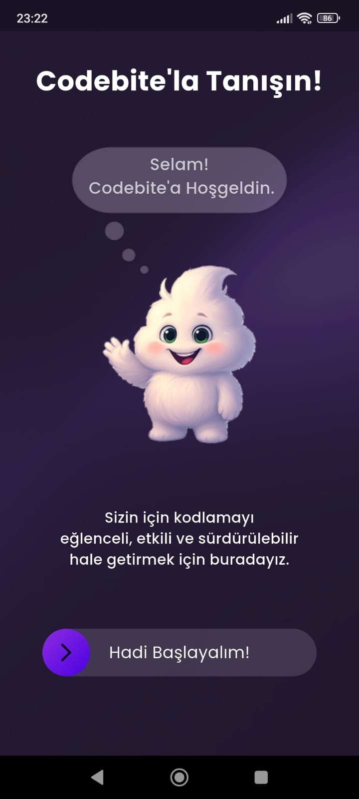 
      <b>Açılış Ekranı</b>
    </td>
    <td align="center">
      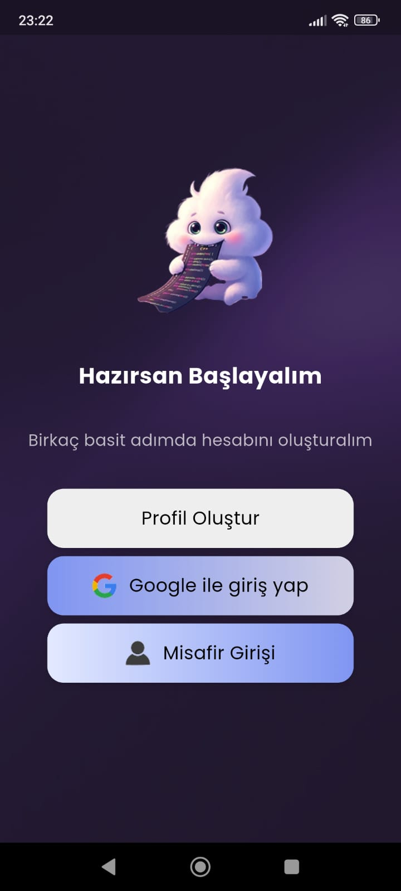 
      <b>Kayıt Ekranı</b>
    </td>
    <td align="center">
      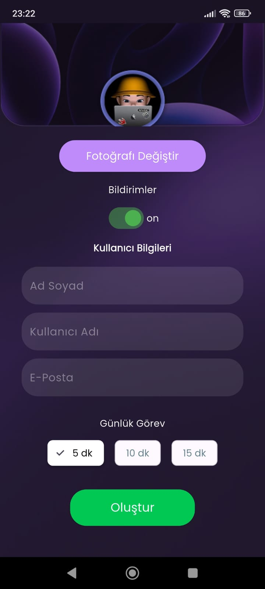 
      <b>Profil Oluşturma Ekranı</b>
    </td>
    <td align="center">
      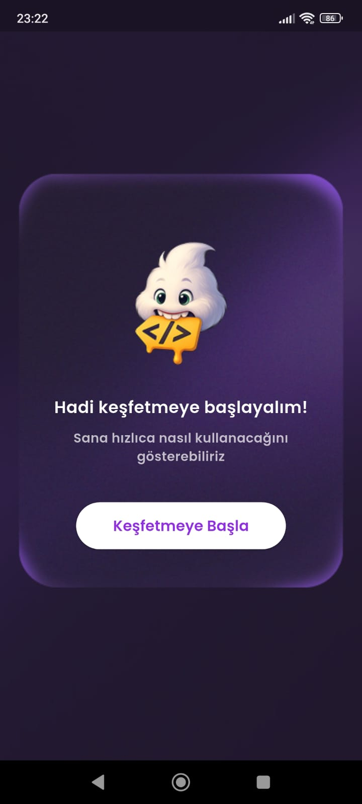 
      <b>Giriş Ekranı</b>
    </td>
    <td align="center">
      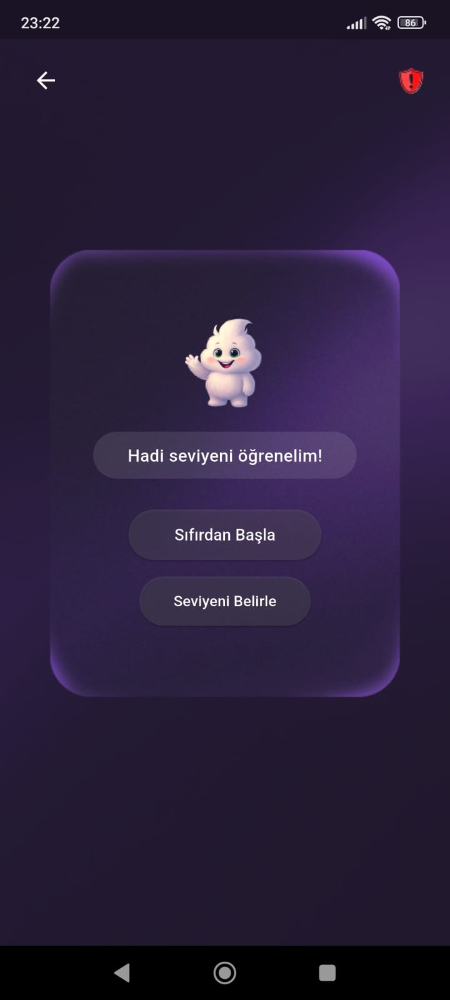 
      <b>Giriş Ekranı</b>
    </td>
</tr>
</table>

<table>
  <tr>
    <td align="center">
      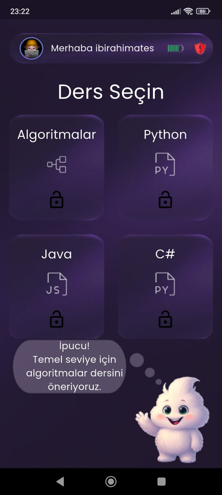 
      <b>Ders Seçme Ekranı</b>
    </td>
    <td align="center">
      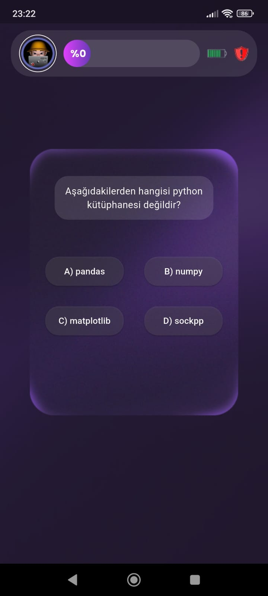 
      <b>Soru Ekranı</b>
    </td>
    <td align="center">
      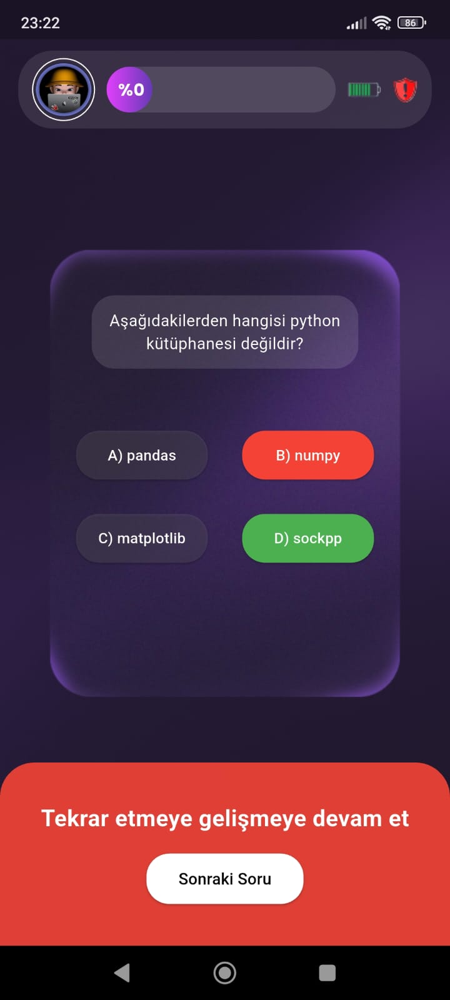 
      <b>Soruya Yanlış Cevap Verilirse</b>
    </td>
    <td align="center">
      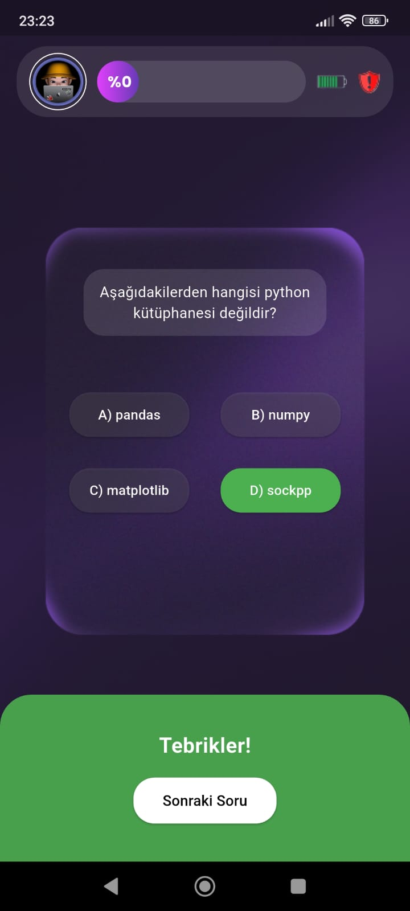 
      <b>Soruya Doğru Cevap Verilirse</b>
    </td>
    <td align="center">
      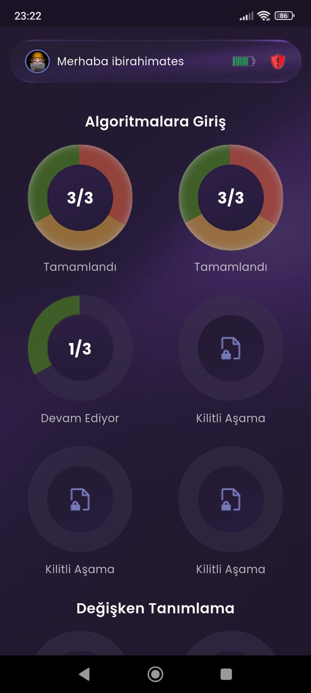 
      <b>Öğrenme Yolu</b>
    </td>
</tr>
</table>

---
# Sprint Puanları ve Görev Dağılımı

## Sprint Board Güncellemeleri
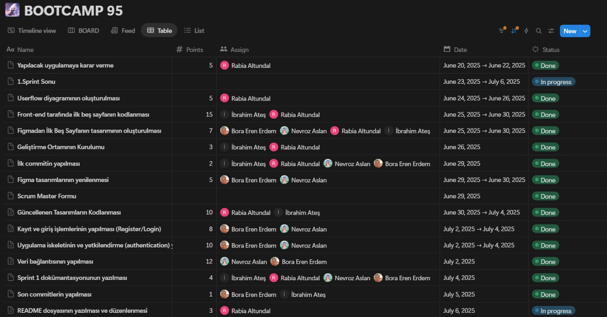

# Burndown Chart
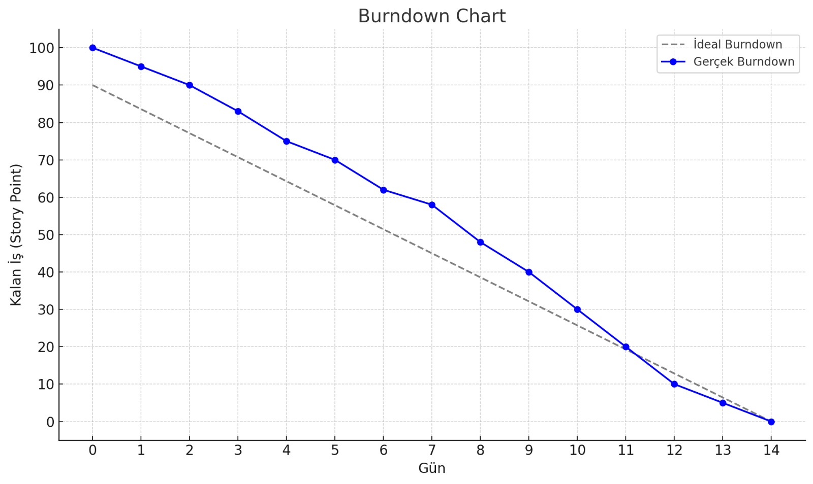

Puan Tamamlama Mantığı

| #  | Görev                                                                                   | Puan |
|----|------------------------------------------------------------------------------------------|------|
| 1  | Uygulama fikrine karar verilmesi                                                         | 5    |
| 2  | Userflow diyagramının oluşturulması                                                      | 5    |
| 3  | Figma üzerinden ilk tasarımların oluşturulması                                           | 7    |
| 4  | Android Studio veya VS Code kurulumu                                                     | 3    |
| 5  | Front-end tarafında ilk beş sayfanın kodlanması                                          | 15   |
| 6  | Figma tasarımının yenilenmesi                                                            | 5    |
| 7  | Güncellenen tasarımların kodlanması                                                      | 10   |
| 8  | İlk commit işleminin gerçekleştirilmesi                                                  | 2    |
| 9  | Backend ile veritabanı bağlantısının sağlanması                                          | 12   |
| 10 | Uygulama iskeletinin ve yetkilendirme (authentication) yapısının oluşturulması          | 10   |
| 11 | Kayıt ve giriş işlemlerinin yapılması (Register/Login)                                  | 8    |
| 12 | Sprint 1 dokümantasyonunun yazılması                                                     | 4    |
| 13 | Son commitlerin yapılması                                                                | 1    |
| 14 | README dosyasının yazılması ve düzenlenmesi                                              | 3    |

*Toplam:* **100 Puan**

---

---
## Sprint Review

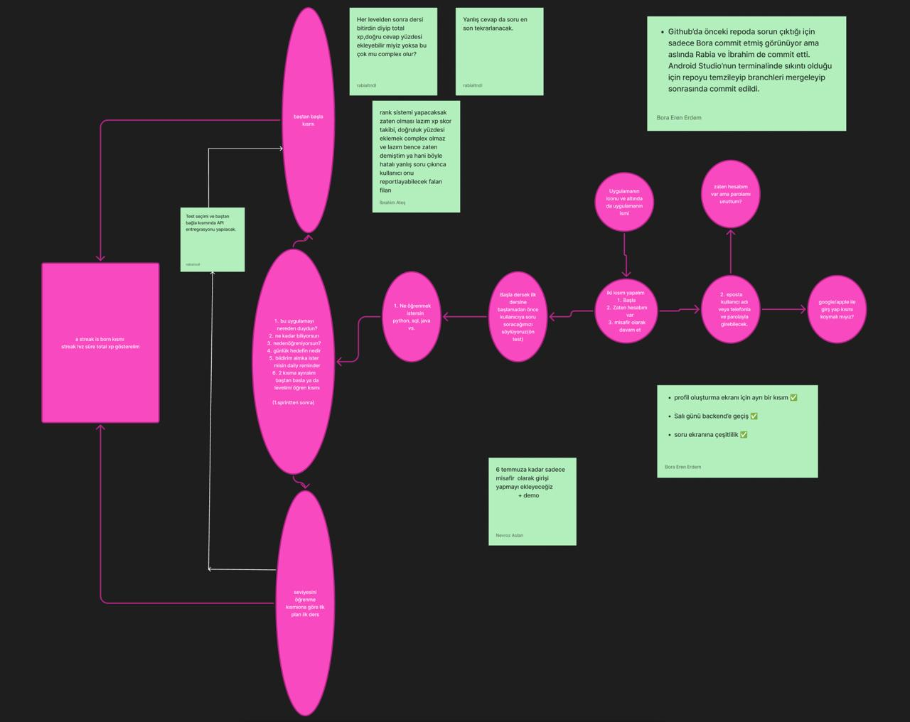
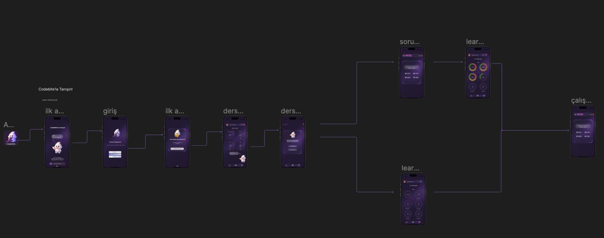
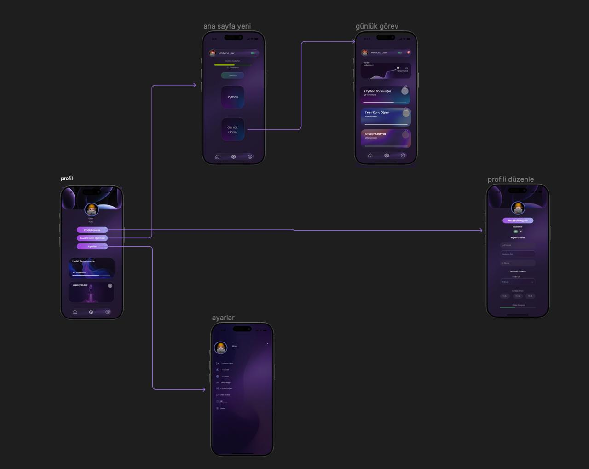

[Figma Sayfamız](https://www.figma.com/design/Z4ecMTd5l7ImfNgZhS8Bgz/codebite?node-id=0-1&p=f&t=E1Le1psq5lt68imt-0)

İlk hafta grup olarak uygulamamızda hangi bölümlerin, hangi sayfaların olması gerektiğine, yapay zekayı hangi kısımda nasıl kullanacağımıza karar verdik.

Konuştuğumuzun kısımları bir userflow diyagramına dönüştürerek oluşturmamız gereken sayfaları adım adım yazdık.

Oluşturduğumuz diyagramdaki düzeni takip ederek sayfa sayfa figma üzerinden ilk tasarımlarımızı oluşturduk.

Aldığımız ortak kararla uygulama ismine CodeBite vererek bu isme uygun maskotumuzu da belirledik.

İkinci hafta Figmadan ilk kısımları oluşturduktan sonra ikiye bölündük. Bora ve Nevroz Figma tasarımlarının devamını yapıp bitirdikten sonra Backend tarafına geçiş yapacakken, İbrahim ve Rabia’nın front-end kısmına başlamasına karar verildi.

Front-end için android studio üzerinden flutter kullanmaya karar verdik.

Tasarımlarımızı ilk halinden şu an kullanılan şık haline getirdik. Oluşan son tasarımın üzerinden de Front-end olarak ilk 10 sayfayı tamamladık.

Codebite uygulamamızı .apk olarak test ettik ve geliştirmemiz gereken taraflarını gözlemledik.

Sprint Review'a Katılanlar: İbrahim Ateş, Rabia Altundal, Bora Eren Erdem, Nevroz Aslan, Nuri Alp Mutlu

## Sprint Retrospective:

Bu sprintte Front-End geliştirme için Android Studio kullanmaya karar verdik. Ancak kurulum süreci tahmin ettiğimizden daha zorluydu. İki haftalık süreçte çeşitli sorunlarla karşılaşsak da, uzun uğraşlar sonunda başarılı bir şekilde kurulumumuzu tamamladık.

Tasarım sürecinde ise, ekip olarak ilk kez kullandığımız Figma'yı oldukça hızlı bir şekilde öğrenip etkin bir şekilde kullanabildik. Kafamızdaki fikirleri somutlaştırmak konusunda bize büyük kolaylık sağladı.

Takım içi iletişim açısından ise; toplantılarımızı verimli geçirmeyi başardık ve birbirimizi eksik olduğumuz noktalarda destekleyerek uyumlu bir şekilde çalıştık.

Yapay zekayı nasıl kullanacağımıza 2.sprintte karar verilecek.

## ---- 1. Sprint Backend Raporu ----

### 1. Sprint Hedefleri

- FastAPI tabanlı bir backend oluşturmak.

- Kullanıcı yönetimi (kayıt, giriş, yetkilendirme) için endpoint’ler geliştirmek.

- Ders ve ilerleme yönetimi için endpoint’ler oluşturmak.

- SQLite veritabanı ile SQLAlchemy entegrasyonunu tamamlamak.

- Admin ve user yetkilendirmesi yapmak.

- Git reposunu temiz ve düzenli bir şekilde yapılandırmak, .gitignore ile gereksiz dosyaları yoksaymak.

- Flutter entegrasyonuna hazırlık yapmak için API’nin temel işlevselliğini tamamlamak.

### 1. Sprint Tamamlanan Hedefler

#### a) Backend Altyapısı:

- requirements dosyası oluşturdu. -> Tamamlandı

- main.py dosyasında FastAPI uygulaması oluşturuldu. Çeşitli ve temel yapılandırmalar yapıldı. Uvicorn kullanıldı. -> Tamamlandı

- SQLite veri tabanı tercih edildi ve codebite.db ile SQLAlchemy ile bağlantı kuruldu. Görüntüleme olarak şimdilik DBeaver kullanıldı. -> Tamamlandı

- Veritabanı bağlantısı ve oturum yönetimi için database.py oluşturuldu. -> Tamamlandı

- models.py dosyasında User, Lesson ve Progress modelleri SQLAlchemy ile tanımlandı ve oluşturuldu. -> Tamamlandı

- schemas.py dosyasında çeşitli API verilerini doğrulamak için Pydantic modelleri (UserRegister, Lesson, Progress, vb.) oluşturuldu. -> Tamamlandı

#### b) API Endpoint’leri:

- Kullanıcı kayıt ve giriş endpointleri geliştirildi. -> Tamamlandı

- JWT tabanlı yetkilendirme (OAuth2) yapıldı ve uygulamanın güvenliği arttırıldı. Bu kısımda schemas.py ve models.py dosyalarındaki classlar ile OAuth2Bearer kısmında sorun çıksa da en sonunda hata bulundu ve fixlenip JWY entegrasyonu başarıyla tamamlandı. -> Tamamlandı

- Admin ve userlar için rol tabanlı yetkilendirme eklendi. -> Tamamlandı

- Ders oluşturma, ders listeleme, ders seçme, kullanıcı derslerini görme ve yetki filtrelemesi yapıldı. -> Tamamlandı

- Progress barları yönetme ve güncelleme yapıldı. -> Tamamlandı

- Admin endpointleri ile user endpointlerine yetki ayrımı ve çeşitli geliştirmeler yapıldı. Admin ve user yetkilendirmelerinde hata alınsa da hata fixlenerek başarıyla tamamlandı. -> Tamamlandı

#### c) Github:

- .gitignore dosyası oluşturuldu ve görüntülenmesi istenmeyen dosyalar gizlendi.

- Dosyalar ayrı ayrı commit edilip her biri için açıklayıcı mesajlar kullanıldı.

- Frontend kısmındaki Flutter ile daha entegre olmadığından ve backend kısmında developerlar olarak daha rahat hareket etmek istenildiğinden main branch yerine master branch'e push edildi. İleride bu branchlerin mergelenmesi planlandı.

**1.Sprint için backend tamamlandı. Flutter entegrasyonu ve backend geliştirme için hazır hale getirildi.**

### 2.Sprint İçin Hedefler:

- Flutter entegrasyonu

- Backend işlemleri detay geliştirme

- Gemini AI entegre ve prompt engineering

- Gemini AI ile kullanıcı seviye tespitine göre AI ile otomatik soru ve oluşturma

- Github'ın düzenli olarak güncellenmesi

  
 SPRINT 2 

## Sprint Notları:

### Bu sprintte gerçekleştirdiğimiz toplantılar, geliştirme süreçleri ve diğer detaylar için [Daily Scrum sayfamızı](https://www.notion.so/Daily-Scrum-Sprint2-23382b3b80e8805a9bebdfd8e8b1cd9a) inceleyebilirsiniz.

- Bu sprintte en önemli hedef, frontend ve backend kısımlarının entegrasyonunun sağlanmasıydı.
- Figmada tasarlanan sayfaların Flutter ile kodlanması tamamlandı.
- Backend tarafında SQLite veritabanı kullanıldı; DBeaver ile veritabanı yönetimi kolaylaştırıldı.
- Kullanıcı yetkilendirme sistemi geliştirildi.
- Seviye belirleme testi için gerekli endpoint’ler oluşturuldu.
- Gemini AI entegrasyonu ile kullanıcının seviyesine göre otomatik soru üretimi sağlandı.
- Dersler bölüm sistemine ayrıldı; her bölüm için ilerleme takibi yapılabilir hâle getirildi.
- Flutter-backend entegrasyonunda yaşanan sorunlar giderildi ve sistem stabil hâle getirildi.

**Backend için Kullanılan Kütüphaneler**

- `fastapi` uygulamanın backend geliştirmesi için kullanıldı.
- `pydantic` ile veri doğrulama ve modelleme işlemleri gerçekleştirildi.
- `bcrypt` ve `passlib` kullanılarak parolalar güvenli bir şekilde şifrelendi.
- `cryptography` kütüphanesi, veri şifreleme işlemleri için projeye entegre edildi.
- `python-jose` kullanılarak JWT ile kimlik doğrulama ve yetkilendirme yapıldı.
- `sqlalchemy` ile veritabanı işlemleri ORM tabanlı olarak gerçekleştirildi.
- `uvicorn`, FastAPI uygulamasını çalıştırmak için sanal sunucu olarak kullanıldı.
- `aiofiles`, asenkron dosya işlemlerini yönetmek için projeye dahil edildi.
- `jinja2` ile HTML şablonları backend'e entegre edilerek dinamik sayfalar oluşturuldu.
- `langchain`, uygulamada LLM tabanlı doğal dil işleme işlemleri için kullanıldı.
- `python-dotenv` ile `.env` dosyasındaki ortam değişkenleri uygulamaya aktarıldı.
- `google-generativeai` kullanılarak Gemini API aracılığıyla yapay zeka cevapları alındı.
- `langchain-google-genai`, LangChain ile Gemini API’nin entegre edilmesini sağladı.
- `markdown`, Gemini’den gelen cevapları HTML formatına dönüştürmek için kullanıldı.
- `bs4 (BeautifulSoup)`, HTML ve XML verilerinden bilgi çekmek için uygulamada yer aldı.
- `starlette`, FastAPI altyapısında kullanılarak HTTP işlemleri desteklendi.
- `python-multipart`, access token içeren form-data isteklerini işlemek için kullanıldı.

----

# Uygulama Ekran görüntüleri

**[Uygulama Ekran Kaydımız](https://www.youtube.com/shorts/1iYmjmZSE4o)**

<table>
  <tr>
    <td align="center">
      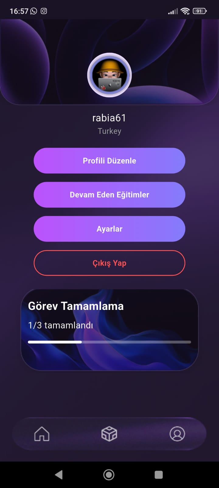 
      <b>Profil Ekranı</b>
    </td>
    <td align="center">
      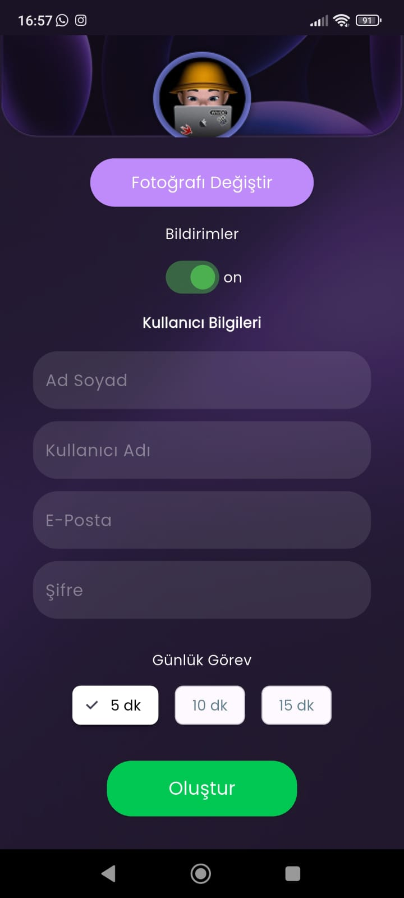 
      <b>Profil Oluşturma Ekranı</b>
    </td>
    <td align="center">
       
      <b>Görev Ekranı</b>
    </td>
        <td align="center">
      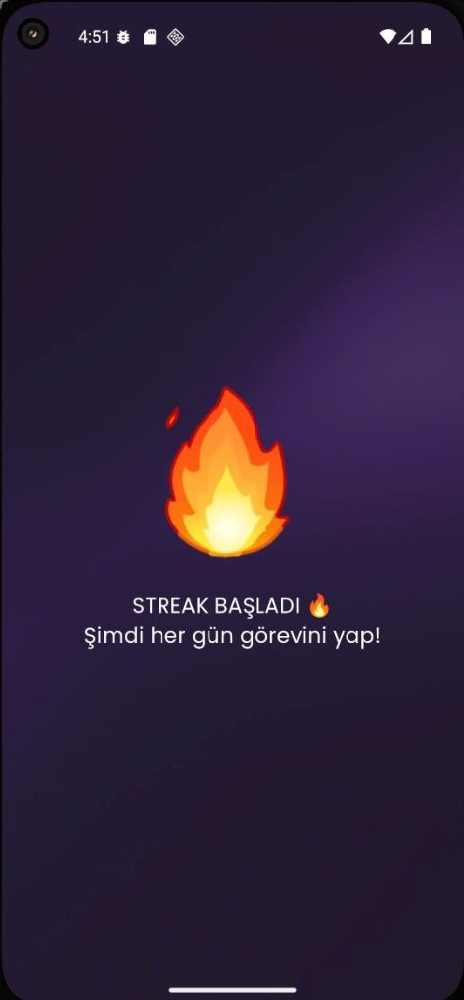 
      <b>Streak Sayfası</b>
    </td>
            <td align="center">
      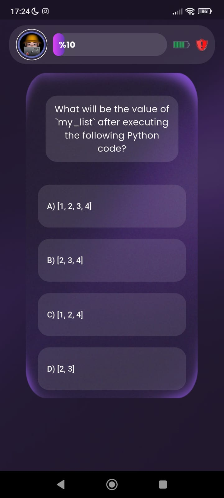 
      <b>Soru Sayfası</b>
    </td>
    
</tr>
</table>

<table>
  <tr>
      <td align="center">
       
      <b>Anasayfa</b>
    </td>
    <td align="center">
      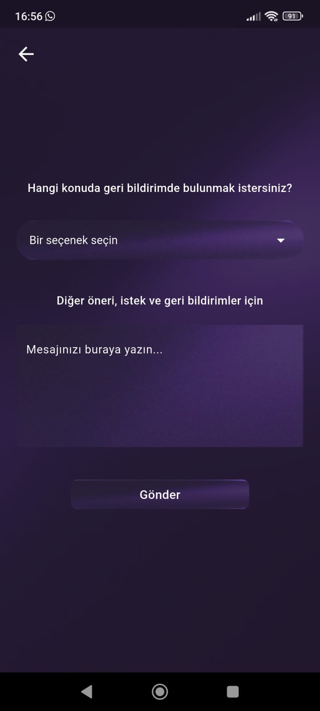 
      <b>Geri Bildirim Ekranı</b>
    </td>
    <td align="center">
      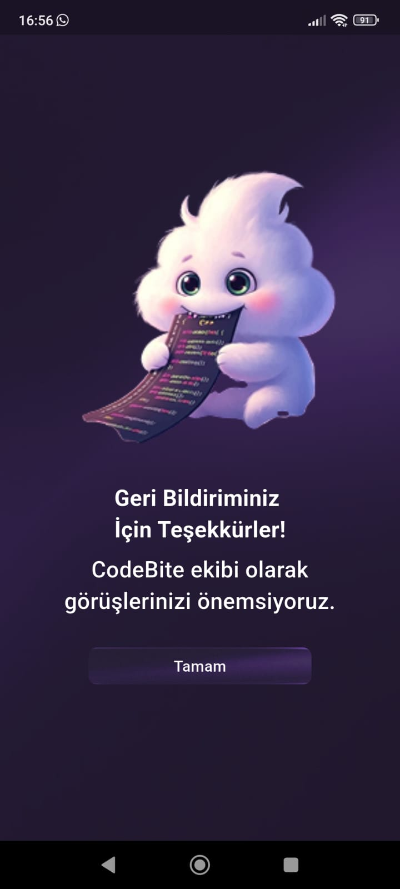 
      <b>Geri Bildirim Teşekkür Sayfası</b>
    </td>
        <td align="center">
      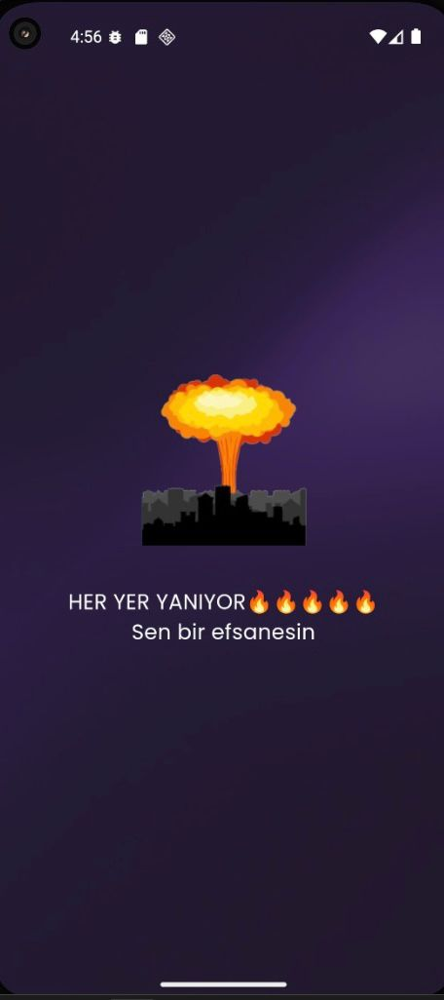 
      <b>Streak Sayfası</b>
    </td>
            <td align="center">
      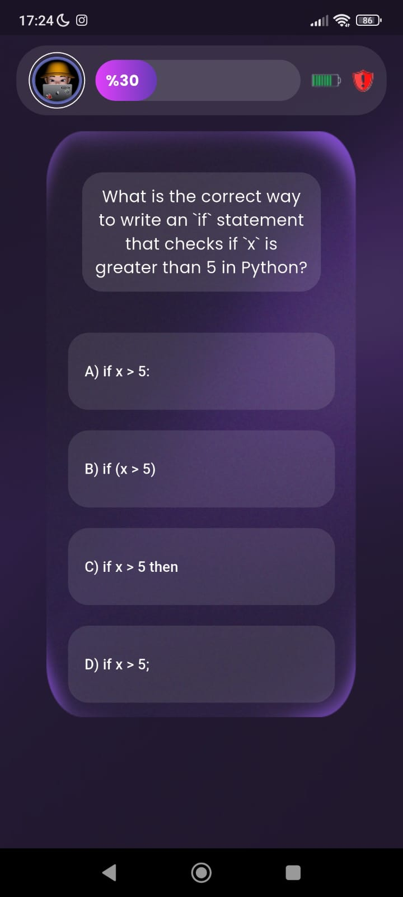 
      <b>Soru Sayfası</b>
    </td>

</tr>
</table>

---
# Sprint Puanları ve Görev Dağılımı
----
## Sprint Board Güncellemeleri
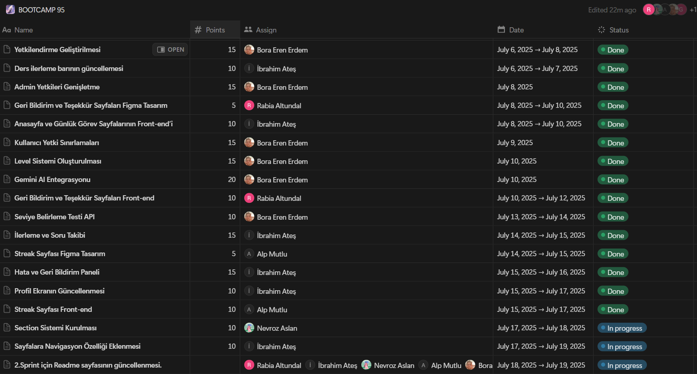
## Burndown chart
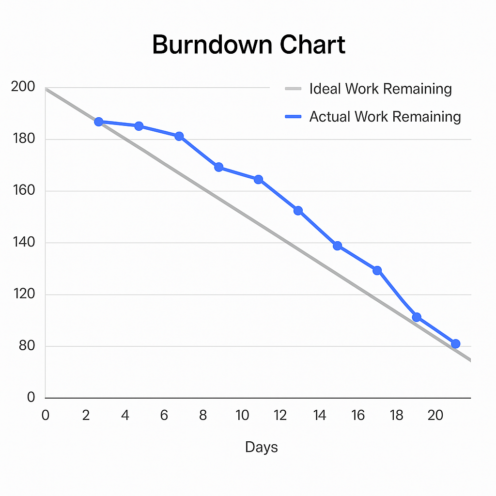
## Puan tamamlama mantığı 200 puan

|  | Görevler | Front-end Puanı | Back-end Puanı |
| --- | --- | --- | --- |
| 1 | Yetkilendirme geliştirmesi |  | 15 |
| 2 | Admin yetkilerinin genişletilmesi |  | 15 |
| 3 | Kullanıcı yetki sınırlamaları |  | 15 |
| 4 | Gemini AI entegrasyonu |  | 20 |
| 5 | Level sistemi oluşturulması |  | 15 |
| 6 | Seviye belirleme testi endpointleri |  | 10 |
| 7 | İlerleme ve soru takibi güncellemeleri |  | 15 |
| 8 | Hata ve geri bildirim paneli |  | 15 |
| 9 | Ders section yapısının oluşturulması |  | 10 |
| 10 | Ders ilerleme barının güncellenmesi |  | 10 |
| 11 | Geri Bildirim ve Teşekkür Sayfaları – Figma tasarımı | 5 |  |
| 12 | Anasayfa ve Günlük Görev Sayfaları – Front-end geliştirmesi | 10 |  |
| 13 | Geri Bildirim ve Teşekkür Sayfaları – Front-end geliştirmesi | 10 |  |
| 14 | Streak Sayfası – Figma tasarımı | 5 |  |
| 15 | Streak Sayfası – Front-end geliştirmesi | 5 |  |
| 16 | Profil ekranının güncellenmesi | 10 |  |
| 17 | Sayfalara navigasyon özelliği eklenmesi | 10 |  |
| 18 | Profil sayasını-Frontend | 5 |  |
|  200| **Toplam Puan** | **70** | **130** |

----

## Sprint Review 

**[Figma Sayfamız Güncellenmiş](https://www.figma.com/design/Z4ecMTd5l7ImfNgZhS8Bgz/codebite?node-id=0-1&p=f&t=E1Le1psq5lt68imt-0)**

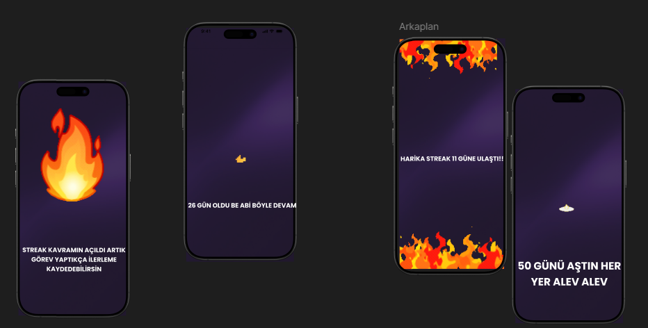
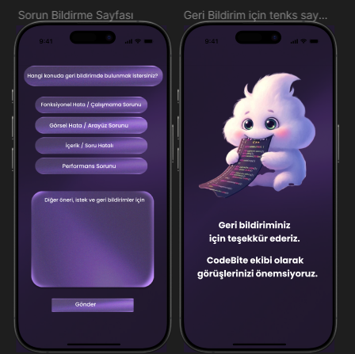
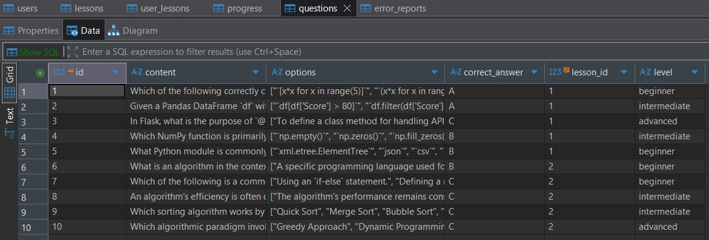
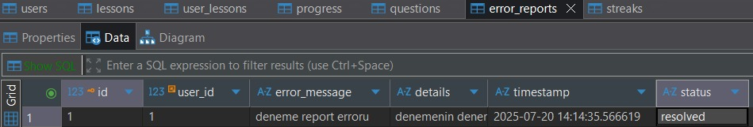

**Front-End & UI/UX**

- **Ders ilerlemesi**, kullanıcıların görebileceği şekilde güncellendi.
- **Geri bildirim ve teşekkür sayfalarının** Figma tasarımları yapıldı; ardından front-end kodlaması tamamlanarak back-end ile entegrasyonu sağlandı.
- **Streak sayfasının** Figma tasarımı ve front-end geliştirmesi yapıldı. Back-end entegrasyonu 3. sprintte gerçekleştirilecek.
- Oluşturulan tüm sayfalara **geri tuşu** ve **geri bildirim sayfasına yönlendirme** özelliği eklendi.
- **Profil ekranı**, eklenen yeni özellikler (şifre oluşturma vb.) doğrultusunda güncellendi. "Zaten hesabım var" ve **şifreli giriş** bölümleri eklendi, back-end ile entegrasyonu tamamlandı.
- **Anasayfa** ve **günlük görev sayfalarının** front-end kısmı tamamlandı. (Tasarım çalışmaları bir önceki sprintte yapılmıştı.)

**Backend** 

- Back-end tarafında `models.py`, `schemas.py`, ve `main.py` dosyaları güncellendi. Ayrıca `routers/error.py` dosyası oluşturuldu.
- Yetkilendirme, seviye sistemi, soru üretimi ve section yapısı gibi birçok temel özellik başarıyla geliştirildi.
- Gemini AI entegrasyonu tamamlandı ve kullanıcının seviyesine göre çoktan seçmeli sorular üretilip veritabanına kaydedilebiliyor.
- Seviye belirleme testi için gerekli endpointler eklendi ve test mantığı oturtuldu.
- Kullanıcı ve admin rollerine özel yetkilendirmeler genişletildi.
- Hata bildirim sistemi geliştirildi ve kullanıcı geri bildirimleri tarih-saat ile kayıt altına alınmaya başlandı.
- Section yapısı oluşturularak derslerin parçalı takibi sağlandı.
- Flutter ile backend entegrasyonuna başlandı. Login ve token işlemlerinde yaşanan hatalar çözüldü, sistem daha stabil hale getirildi.
- Github üzerinden düzenli commit ve versiyon kontrolü yapıldı.

Sprint Review'a Katılanlar: İbrahim Ateş, Rabia Altundal, Bora Eren Erdem, Nevroz Aslan, Nuri Alp Mutlu

----

### Sprint Retrospective
- Bu sprintte bizi en çok zorlayan kısım, **frontend ile backend entegrasyonunu sağlamak** oldu. Özellikle **Flutter’daki SDK ve NDK yapılandırmaları**, geliştirme sürecinde birçok teknik sorun çıkardı ve önemli ölçüde zaman kaybına yol açtı.

- 2.Sprint boyunca en çok emek harcadığımız alan bu oldu ve 3. Sprintte de en çok zaman ayırmamız gereken kısım olacağı öngörülüyor.

- Bunlara ek olarak 2.sprintte takım içi iletişimde bazı zorluklarla karşılaştık.

- Ekip üyelerimizden üçünün stajlarına başlaması, günlük iş yoğunluğunun artması ve teknik problemlerle uğraşmak zorunda kalmamız, ekip içi koordinasyonu zaman zaman zorlaştırdı.

- Ancak tüm bu koşullara rağmen, ekip olarak iletişimimizi sürdürerek görevlerimizi tamamlamaya odaklandık ve motivasyonumuzu yüksek tutmaya gayret ettik. Bu süreç, zaman yönetimi açısından da bize önemli bir deneyim kazandırdı.

---
## --- 2. Sprint Backend Raporu ----

### 2.Sprint Hedefleri

- Backend kısmındaki yetkilendirme ve yönlendirme kısımlarının geliştirilmesi.
- Adminler için daha esnek ve geniş yetkilendirmeler yapmak.
- Kullanıcılar için daha fazla seçenek ve yetki sınırlaması yapmak.
- Gemini AI entegrasyonu ile database'e belirli derslerle ilgili soru generate etmek.
- Sorular ve kullanıcılar için level sistemi eklemek.
- Seviye belirleme testi için gerekli endpointleri geliştirmek.
- Dersler için gerekli ilerlemeleri ve soruların takip edilmesi için gerekli güncellemeler ve eklemeler.
- Hata ve geri bildirim için panel eklenmesi.
- Derlerin sectionları için ayrı yapı oluşturma.

### 2.Sprint Tamamlanan Hedefler

### a) Backend Altyapısı:

- routers/auth.py dosyasına yetkilendirme kısımları güncellendi. -> Tamamlandı
- routers/auth.py dosyası için admin ve user ayrımı yapılması ve hataların güncellenmesi. -> Tamamlandı
- routers/auth.py dosyası için admin yetkilerinin esnetilmesi ve genişletilmesi, user kısımlarının ise yeni sınırlamalar getirilmesi. -> Tamamlandı
- JWT Token mantığı güncellendi. Bu kısımda hatalarla ve düzeltmelerle uğraşıldı ancak sonunda düzeltildi. -> Tamamlandı
- [models.py](http://models.py/) dosyasına yeni modeller eklendi ve var olan modeller güncellendi. Yeni özellikler eklendi ve modeller arası ilişkiler kuruldu. (many-to-many, one-to-many) -> Tamamlandı
- [models.py](http://models.py/) dosyasına derslerin konuları için Section sınıfı eklendi. -> Tamamlandı
- [main.py](http://main.py/) dosyası güncellendi ve gereksiz özellikler çıkarıldı. Sadece denemek için shortcut endpointleri eklendi. (sonradan kaldırılacak) -> Tamamlandı
- [schemas.py](http://schemas.py/) dosyası güncellendi ve yeni eklemeler yapıldı. [models.py](http://models.py/) dosyasına göre gerekli şemalar oluşturuldu. -> Tamamlandı
- routers/error.py dosyası eklendi. Adminler ve kullanıcılar için yetkilendirme işlemleri yapıldı. Kullanıcıların raporlama sisteminin geri bildirimini database'e tarih ve saat olarakta kaydetmesi sağlandı. -> Tamamlandı
- routers/lesson.py dosyasına derslerle ilgili çeşitli işlemler ve eklemeler yapıldı. Önceki 1.sprintte yer alan hatalar fixlendi. Yeni pydantic sınıfları eklendi. -> Tamamlandı
- routers/lesson.py dosyasına soru generate için Gemini AI endpointi eklendi ve prompt engineering yapıldı. Bu kısımda belli başlı kısıtlamalara takınılsa da sonunda optimize hale getirildi. Artık database'e kullanıcının leveline, aldığı derse ve dersin kategorisine göre çoktan seçmeli olarak soru generate edilebiliyor ve doğru cevapları da database'e kaydediyor. -> Tamamlandı
- routers/lesson.py dosyasına sadece adminler için ders silme endpointi eklendi. -> Tamamlandı
- routers/lesson.py dosyasına seviye belirleme testi olan level test endpointi eklendi ve hatalar fixlendi. Ayrıca bu kısım için geçici olarak tutulan sorular kalıcı hale getirildi ve prompt tekrar gözden geçirildi. Kullanıcıların doğru sayısına göre level sistemi atama tanımlandı. -> Tamamlandı
- routers/lesson.py dosyasındaki level test submit kısmı eklendi. Admin ve user yetkileri güncellendi ve seviye belirleme testine giren kullanıcıların girip girmediğinin kontrolü yapılması sağlandı. -> Tamamlandı
- routers/lesson.py dosyasına frontend'in backend kısmından soru alabilmesi için question response modeli eklendi. -> Tamamlandı
- routers/lesson.py dosyasına kullanıcının seçilen dersin sectionlarını görebilmesi için endpoint eklendi. -> Tamamlandı
- routers/lesson.py dosyasına sectionların sadece adminler tarafından oluşturulabilmesi için endpoint eklendi. -> Tamamlandı
- routers/lesson.py dosyasına sectionların sistemi oluşturuldu. Dersler için birden fazla section desteği sağlandı. Her section, kendi içinde total_parts (varsayılan 3) ile ilerleme takibi yapıldı. Section ilerlemesi 3/3 olursa bir sonraki sectiona geçilmesi sağlandı. -> Tamamlandı
- routers/lesson.py dosyasına userların section ilerlemesini gösterebilmesi için endpoint eklendi. -> Tamamlandı.

Backend kısmında hala belirli eksiklikler ve eklenmesi gereken kısımlar var. Duruma göre güncellenmesi de gerekebilir. Şu anlık genel olarak backend kısmı yeterli ve çalışıyor. Ancak geliştirilmesi gerekiyor.

### b) Flutter ve Backend Entegrasyonu:

- Flutter ve Backend kısımlarının entegrasyonunda çok fazla hata yaşandı. Özellikle login ve token kısmında flutterdaki shared_preferences kaynaklı sorunlar çözüldü. Sistem daha stabil hale getirildi. -> Tamamlandı
- Flutter kısmına zaten hesabım var kısmı eklendi. -> Tamamlandı
- Profil oluşturma entegre edildi. -> Tamamlandı

Flutter kısmında hala belirli sıkıntılar var. Özellikle backend ile entegrasyonunda sorun çıkabiliyor. Bunların çözülmesi lazım.

### c) Github:

- Düzenli olarak master branche güncellemeler ve eklemeler açıklayıcı commitlerle push edildi.

*2.Sprint için backend tamamlandı. Flutter kısmıyla entegrasyon yapılmaya başlandı. Uygulamanın canlıya çıkmasına yaklaşıldı.*

---

### 3.Sprint İçin Hedefler:

- Uygulamanın reklam stratejisi belirlenecek.
- Yayın kanalı seçildikten sonra uygun içerikler hazırlanacak.
- Uygulamanın tanıtım videosu oluşturulacak.
- Eksik özellikler tamamlanarak uygulama canlıya alınacak.
- Flutter ve backend entegrasyonu eksiksiz ve sorunsuz şekilde gerçekleştirilecek.
- Backend, tamamlanmış haliyle test edilecek.
- Uygulama mağazası açıklamaları ve görselleri hazırlanacak.
- Gerekli tüm geliştirmeler tamamlandıktan sonra uygulama yayına alınıcak.
- Kullanıcı deneyimi (UX) testleri gerçekleştirilecek.
- Geri bildirim toplama mekanizması (feedback flow) iyileştirilecek.
- Versiyonlama ve sürüm takibi için dökümantasyon güncellenecek.
- Uygulama güvenliği test edilerek varsa açıklar kapatılacak.
- Admin girişi yapıp giriş sonrası alınan JWT token ile yetkili işlemler, 4 dersi oluşturup swagger UI üzerinden endpoint ile dersler eklenip 3 farklı zorluk seviyesinde soru ürettirilicek.

SPRINT 3

---

Daily Scrum

### Bu sprintte gerçekleştirdiğimiz toplantılar, geliştirme süreçleri ve diğer detaylar için [Daily Scrum sayfamızı](https://www.notion.so/Daily-Scrum-Sprint3-23882b3b80e8802dbdd9e37e0c412d10?source=copy_link) inceleyebilirsiniz.

---

Sprint Notes

# **Sprint Notes**

### **Front-end & UI/UX**

- Avatar sistemi oluşturuldu ve backend ile entegre edildi.
- Streak sistemi başarıyla entegre edildi.
- Ayarlar sayfasının navigasyonu güncellendi.
- Geri bildirim sayfası yenilendi.
- Misafir giriş sistemi backend ile bağlandı.
- Yeni sayfalar eklendi ve front-end güncellendi.
- Günlük görev sistemi entegre edildi.
- Hesap silme ve dil değiştirme özellikleri düzeltildi.
- Avatar güncelleme özellikleri `profile.dart` ve `update_profile` sayfalarına eklendi.
- Snackbar ve kullanıcı çubuğu iyileştirildi.
- APK dosyası hazırlandı.
- Login ve ders seç sayfaları güncellendi.
- Şifre yenileme entegrasyonu tamamlandı.
- Typing animasyonu eklendi ve nickname alanı düzeltildi.

### **Tanıtım**

- Kısa ekran kayıtları alındı ve reklam yazıları hazırlandı.
- Reklam filmi denemeleri yapıldı ve müzik eklendi.
- Youtube kanalı oluşturuldu, reklam ve tutorial videoları yüklendi.

### **Backend Geliştirmede Kullanılan Kütüphaneler ve Modüller**

- **`FastAPI`**: Uygulamanın tüm backend yapısını kurmak ve API endpoint’lerini tanımlamak için kullanıldı.
- **`SQLAlchemy`**: Veritabanı modellerini oluşturmak ve tablolar arası ilişkileri yönetmek amacıyla projeye dahil edildi.
- **`Alembic`**: Veritabanı üzerinde yapılan şema değişikliklerini takip etmek ve versiyonlamak için entegre edildi.
- **`SQLite`**: Geliştirme sürecinde lokal testler için tercih edildi.
- **`PostgreSQL`**: Canlı ortamda güvenli ve ölçeklenebilir veritabanı yapısı sağlamak amacıyla kullanıldı.
- **`python-jose`**: JWT (JSON Web Token) tabanlı kimlik doğrulama ve yetkilendirme işlemleri gerçekleştirildi.
- **`authlib`**: Google ile giriş özelliğini entegre etmek için denendi ancak bu özellik daha sonra askıya alındı.
- **`datetime`**: Token süresi hesaplama ve tarih bazlı işlemler için kullanıldı.
- **`passlib`**: Kullanıcı şifrelerinin güvenli bir şekilde hash’lenmesi için kullanıldı.
- **`smtplib`**: Sistem tarafından otomatik e-posta gönderimi sağlamak amacıyla projeye entegre edildi.
- **`email.mime`**: E-posta içeriklerini biçimlendirmek ve zengin içerikli e-posta oluşturmak için kullanıldı.
- **`uuid`**: Uygulama içerisindeki kullanıcı, görev ve diğer varlıklar için benzersiz kimlikler oluşturmakta kullanıldı.
- **`logging`**: Uygulama içi olayları kayıt altına almak ve hata ayıklama sürecini desteklemek için kullanıldı.
- **`os`** ve **`python-dotenv`**: `.env` dosyasındaki ortam değişkenlerini uygulamaya aktarmak için birlikte kullanıldı.
- **`pydantic`**: API endpoint’lerinde kullanılan giriş ve çıkış verilerinin doğruluğunu kontrol etmek ve şema tanımlamak amacıyla tercih edildi.
- **`APScheduler`**: Bazı işlemlerin otomatik olarak zamanlanması için denendi ve entegrasyon süreci başlatıldı.

---

Uygulama Ekran Görüntüleri

# Uygulama Ekran görüntüleri

[Uygulama Ekran Kaydımız](https://youtube.com/shorts/k9HM3KN2m-A)

<table>
  <tr>
    <td align="center">
      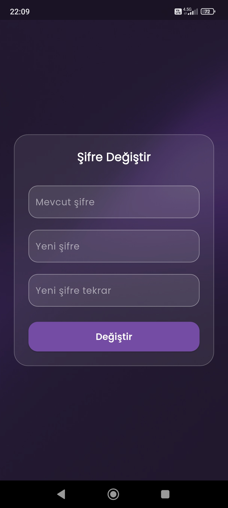 
      <b>Şifre Değiştirme Ekranı (Uygulama içi)</b>
    </td>
    <td align="center">
      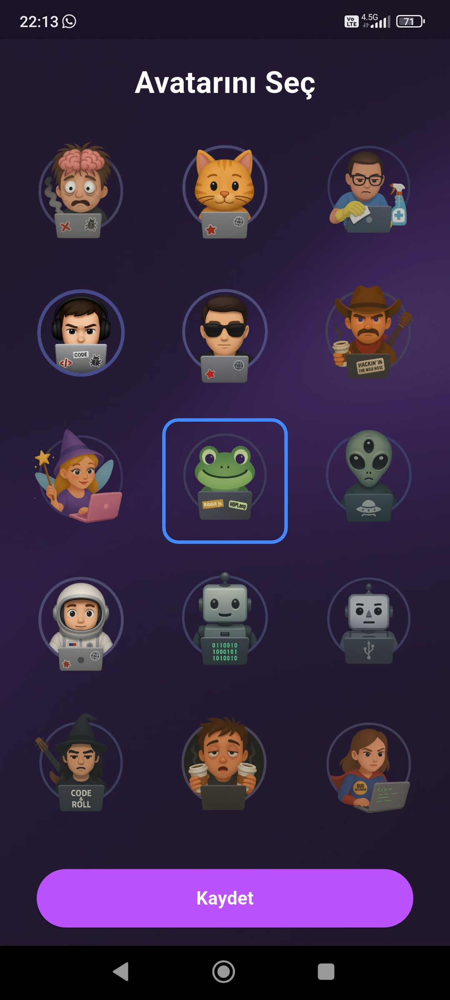 
      <b>Avatar Değiştirme Ekranı</b>
    </td>
    <td align="center">
      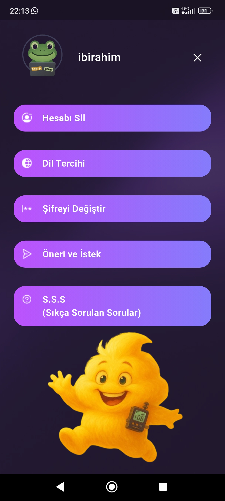 
      <b>Ayarlar Ekranı</b>
    </td>
    <td align="center">
      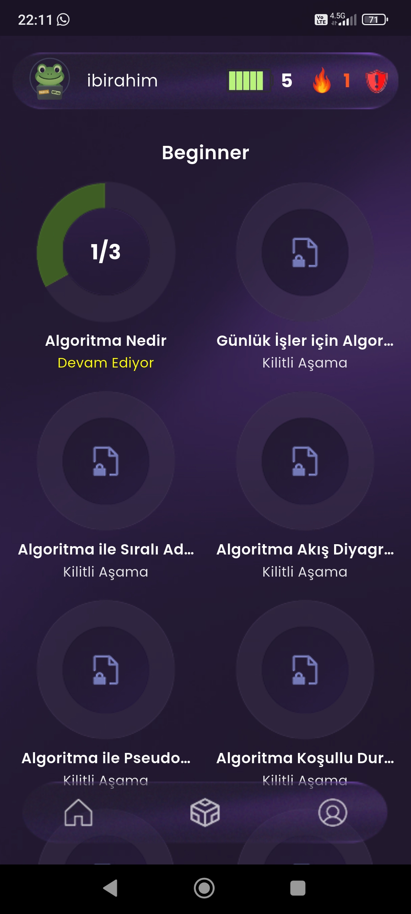 
      <b>Ders Ekranı</b>
    </td>
    <td align="center">
      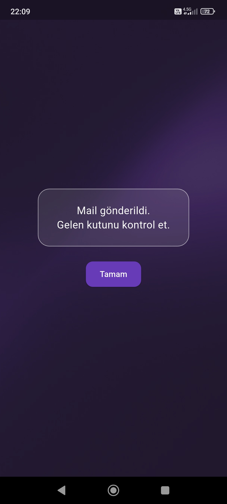 
      <b>Email Gönderme Ekranı</b>
    </td>
        <td align="center">
      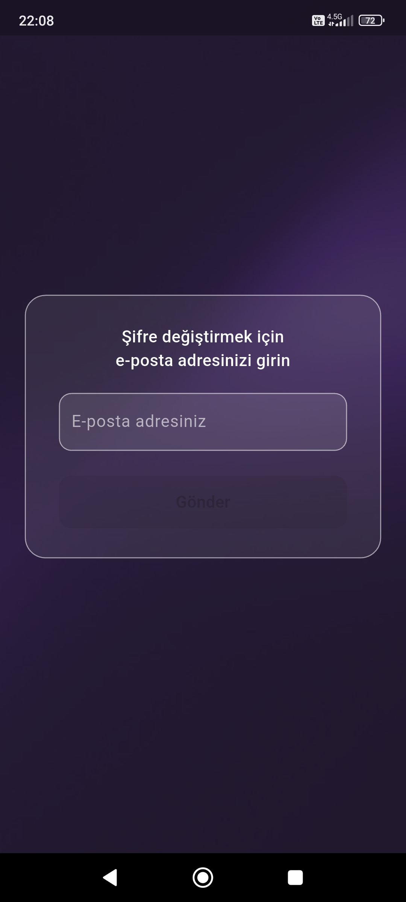 
      <b>Email Şifre Değiştirme Ekranı</b>
    </td>
        <td align="center">
      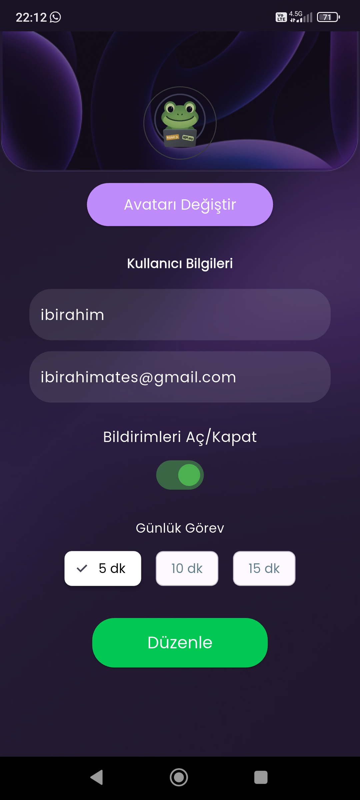 
      <b>Profil Güncelleme Ekranı</b>
    </td>
</tr>
</table>

<table>
  <tr>
    <td align="center">
      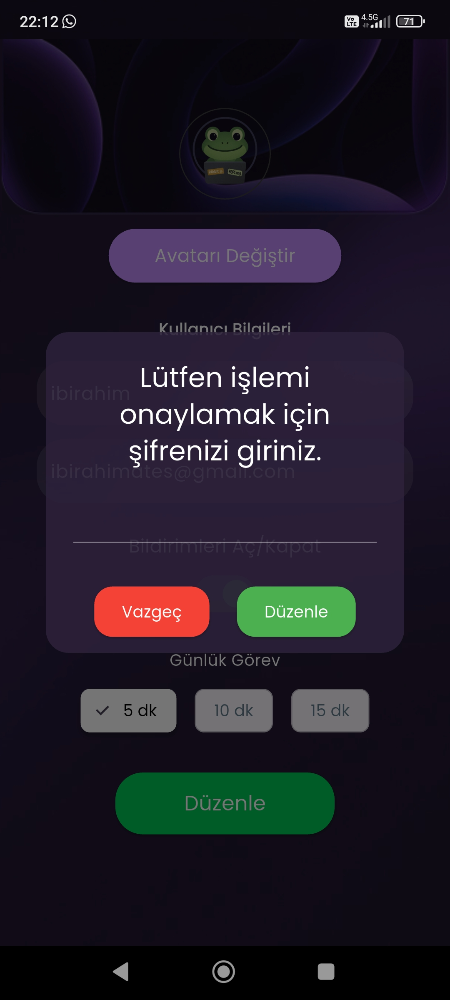 
      <b>Profil güncelleme şifre Onayı Ekranı</b>
    </td>
    <td align="center">
      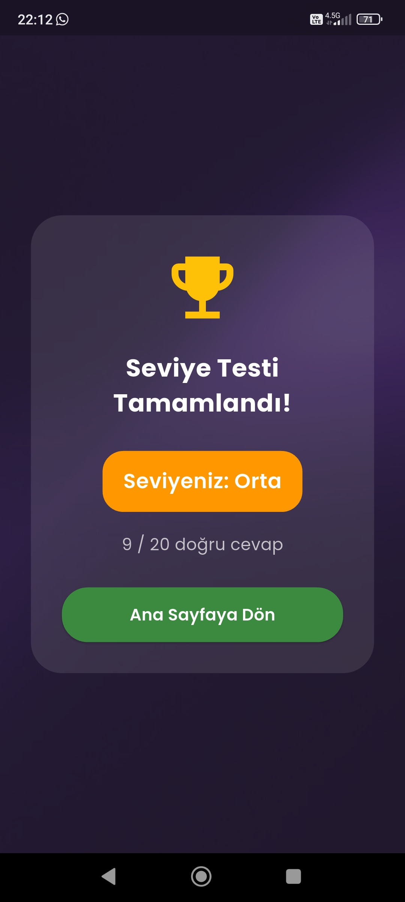 
      <b>Seviye Belirleme Sonuç Ekranı</b>
    </td>
    <td align="center">
      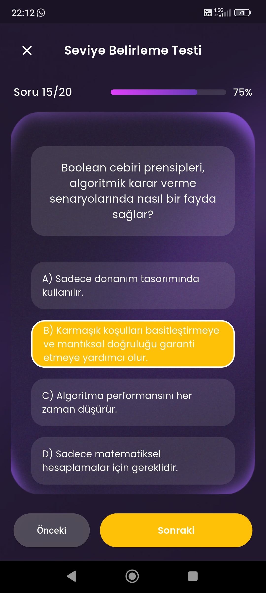 
      <b>Seviye Belirleme Test Ekranı</b>
    </td>
    <td align="center">
      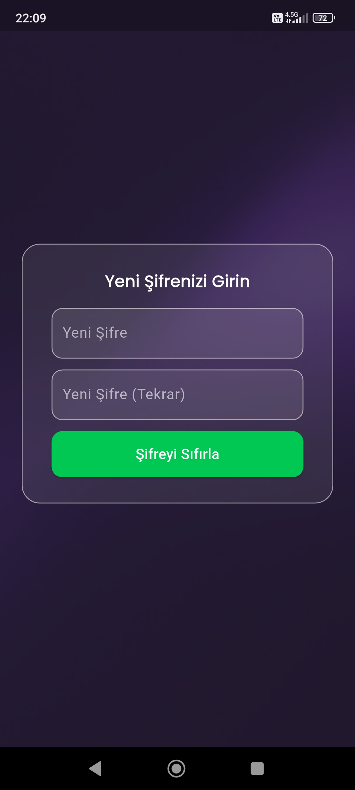 
      <b>Şifremi Unuttum Ekranı</b>
    </td>
    <td align="center">
      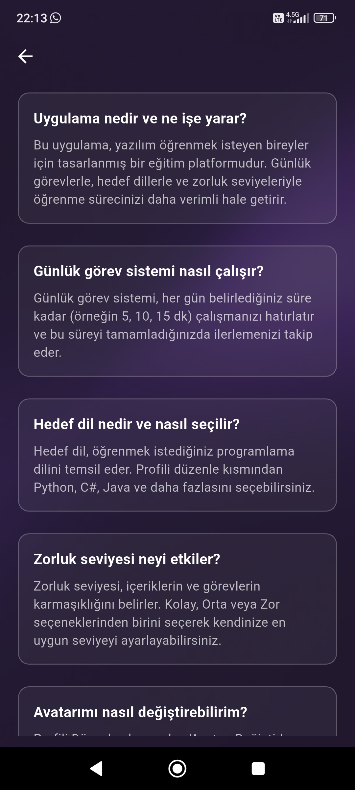 
      <b>Sıkça Sorulan Sorular Ekranı</b>
    </td>
        <td align="center">
      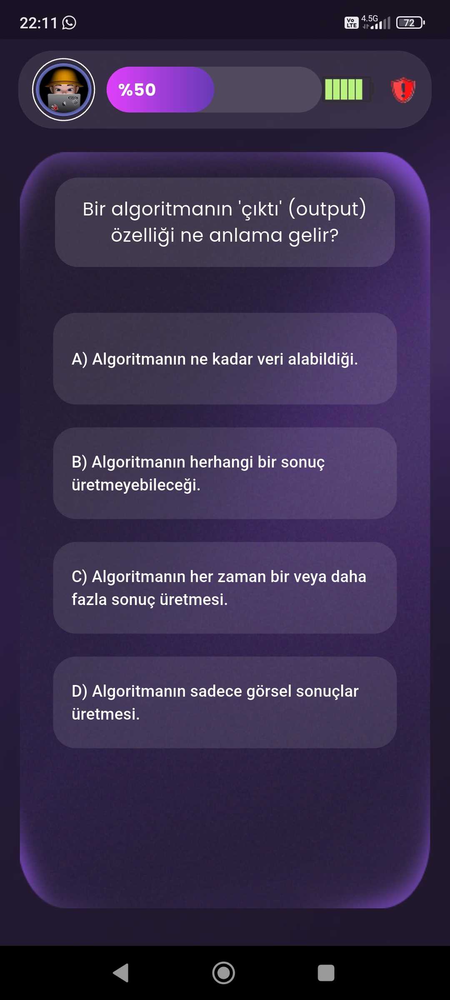 
      <b>Soru Ekranı</b>
    </td>
    <td align="center">
      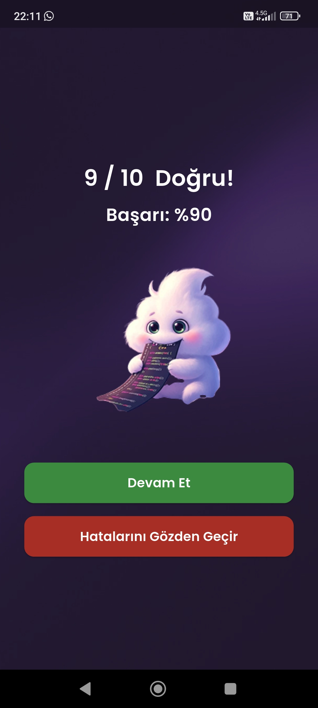 
      <b>Sonuç Ekranı</b>
    </td>
</tr>
</table>

----

Burndown Chart

## Burndown chart
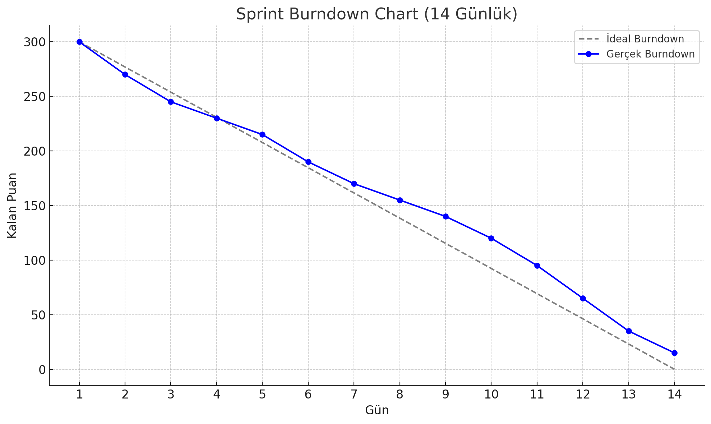

---

Sprint Board Güncellemeleri

## Sprint Board Güncellemeleri

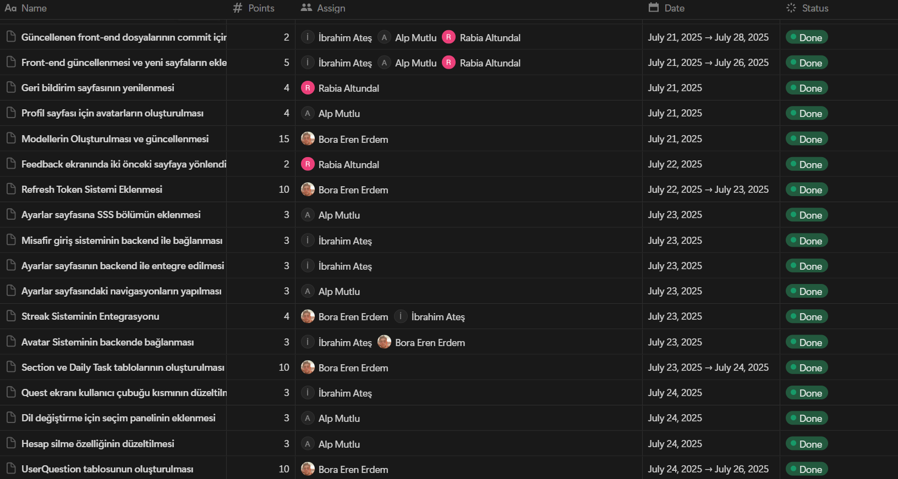

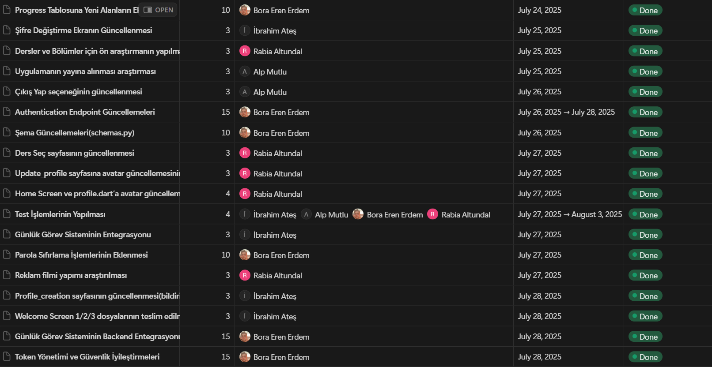

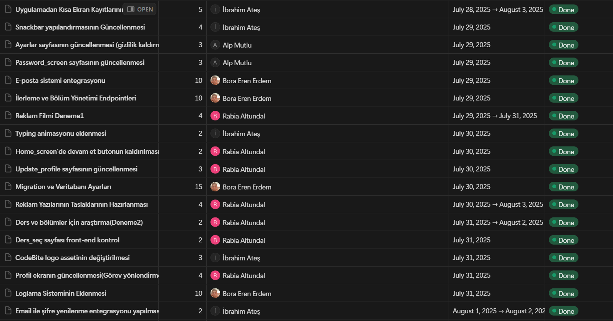

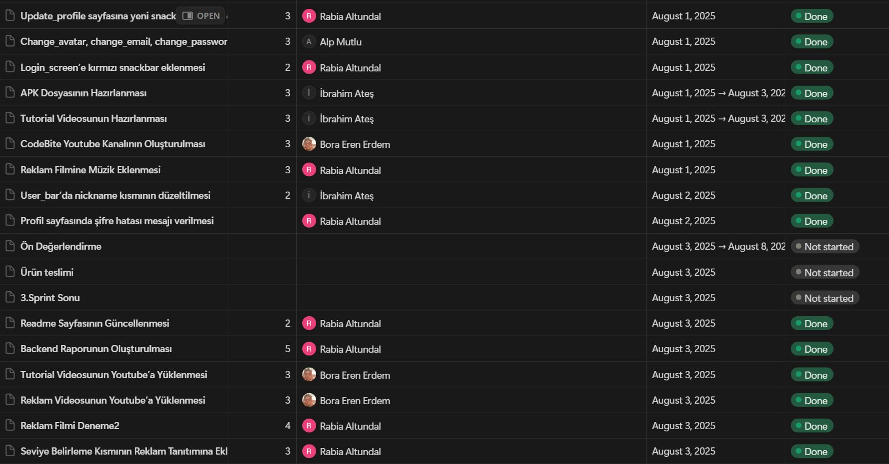

---

Sprint İçinde Tamamlanması Tahmin Edilen Puan 

## Sprint İçinde Tamamlanması Tahmin Edilen 300 puan
Sprint 3 için toplam 300 puanlık bir iş yükü belirlendi. Bu puan, öncelikli olarak Front-end tarafında yapılacak yeni eklemeler ve güncellemeler nedeniyle 110 olarak belirlendi. Uygulamanın tanıtımı kapsamında hazırlanacak tutorial ve reklam videoları için 40 puan, Backend tarafındaki geliştirmeler için ise 150 puan ayrıldı. Aşağıdaki tablolarda her kategoriye ait puan dağılımı detaylı şekilde sunulmuştur.

---

Puan Tamamlama Mantığı

## Puan Tamamlama Mantığı

### Front-end 

| No | Görevler | Puan |
| --- | --- | --- |
| 1 | Profil sayfası için avatarların oluşturulması | 4 |
| 2 | Avatar sisteminin backend'e bağlanması | 3 |
| 3 | Streak sisteminin entegrasyonu | 4 |
| 4 | Ayarlar sayfasındaki navigasyon yapılması | 3 |
| 5 | Ayarlar sayfasının backend ile entegre edilmesi | 3 |
| 6 | Geri bildirim sayfasının yenilenmesi | 4 |
| 7 | Feedback ekranında önceki sayfaya yönlendirme yapılması | 2 |
| 8 | Misafir giriş sisteminin backend ile bağlanması | 3 |
| 9 | Front-end güncellenmesi ve yeni sayfaların eklenmesi | 5 |
| 10 | Ayarlar sayfasına SSS bölümünün eklenmesi | 3 |
| 11 | Günlük görev sisteminin entegrasyonu | 5 |
| 12 | Uygulamanın yayına alınması araştırması | 3 |
| 13 | Test işlemlerinin tamamlanması | 4 |
| 14 | Hesap silme özelliğinin düzeltilmesi | 3 |
| 15 | Dil değiştirme için seçim paneli eklenmesi | 3 |
| 16 | Quest ekranı kullanıcı çubuğunun düzeltilmesi | 3 |
| 17 | Ders ve bölümler için ön araştırma yapılması | 2 |
| 18 | Şifre değiştirme ekranının güncellenmesi | 3 |
| 19 | Çıkış yap seçeneğinin düzeltilmesi | 3 |
| 20 | Home screen ve profile.dart’a avatar güncelleme eklenmesi | 4 |
| 21 | Update_profile sayfasına avatar güncelleme eklenmesi | 3 |
| 22 | Güncellenen front-end dosyalarının teslim edilmesi | 2 |
| 23 | Ders seç sayfasının güncellenmesi | 3 |
| 24 | Welcome_screen1/2/3 sayfalarının güncellenmesi | 3 |
| 25 | Login_screen sayfasının güncellenmesi | 3 |
| 26 | Password_screen sayfasının güncellenmesi | 3 |
| 27 | Profil oluşturma sayfasının güncellenmesi (bildirim seçeneği) | 3 |
| 28 | Ayarlar sayfasının güncellenmesi (gizlilik kaldırma, uyarılar) | 3 |
| 29 | Update_profile sayfasının güncellenmesi | 3 |
| 30 | Profil ekranı güncellemesi (görev yönlendirme, streak arka planı) | 4 |
| 31 | Snackbar yapılandırmasının güncellenmesi | 3 |
| 32 | Home screen’de "Devam Et" butonunun kaldırılması | 2 |
| 33 | APK dosyasının hazırlanması | 3 |
| 34 | CodeBite logosunun asset dosyasının değiştirilmesi | 2 |
| 35 | Ders seç sayfasının kontrol edilmesi | 2 |
| 36 | Login_screen’e kırmızı snackbar eklenmesi | 2 |
| 37 | Change_avatar, change_email, change_password sayfalarının kontrolü | 3 |
| 38 | Profil sayfasına şifre hatası mesajı eklenmesi | 3 |
| 39 | Update_profile sayfasına yeni snackbar sistemi eklenmesi | 3 |
| 40 | User_bar’da nickname kısmının düzeltilmesi | 2 |
| 41 | Email ile şifre yenileme entegrasyonu yapılması | 2 |
| 42 | Typing animasyonu eklenmesi | 2 |
| 43 | Ders ve bölümler için araştırma yapılması (Deneme 2) | 2 |
| 44 | Readme sayfasının güncellenmesi | 2 |
|  | **Toplam Puan** | 110 |

### Reklam/Tanıtım Videoları

| No | Görevler | Puan |
| --- | --- | --- |
| 1 | Uygulamadan kısa ekran kayıtlarının alınması | 5 |
| 2 | Reklam yazılarının taslaklarının hazırlanması | 4 |
| 3 | Reklam filmi yapımı araştırılması | 3 |
| 4 | Reklam filmi deneme 1 | 4 |
| 5 | Reklam filmine müzik eklenmesi | 3 |
| 6 | Seviye Belirleme kısmının reklam tanıtımına eklenmesi | 3 |
| 7 | Reklam filmi deneme 2 | 4 |
| 8 | CodeBite Youtube kanalının oluşturulması | 3 |
| 9 | Reklam videosunun Youtube’a yüklenmesi | 3 |
| 10 | Tutorial videosunun hazırlanması | 3 |
| 11 | Tutorial videosunun Youtube’a yüklenmesi | 1 |
|  | **Toplam Puan** | 40 |

### Back-end

| No | Görevler | Puan |
| --- | --- | --- |
| 1 | Modellerin oluşturulması ve güncellenmesi | 15 |
| 2 | Refresh token sistemi eklenmesi | 10 |
| 3 | Section ve Daily Task tablolarının oluşturulması | 10 |
| 4 | Progress tablosuna yeni alanların eklenmesi | 10 |
| 5 | UserQuestion tablosunun oluşturulması | 10 |
| 6 | Şema güncellemeleri (schemas.py) | 10 |
| 7 | Authentication endpoint güncellemeleri | 15 |
| 8 | Parola sıfırlama işlemlerinin eklenmesi | 10 |
| 9 | Token yönetimi ve güvenlik iyileştirmeleri | 15 |
| 10 | Günlük görev sisteminin backend entegrasyonu | 10 |
| 11 | İlerleme ve bölüm yönetimi endpointleri | 10 |
| 12 | E-posta sistemi entegrasyonu | 10 |
| 13 | Migration ve veritabanı ayarları | 15 |
| 14 | Loglama sistemi eklenmesi | 10 |
| 15 | Backend raporunun oluşturulması | 5 |
|  | **Toplam Puan** | 150 |

---

Sprint Review

# Sprint Review

### **Front-end & UI/UX**

- Avatar sistemi oluşturuldu ve backend’e bağlandı.
- Streak sistemi ve günlük görevler entegre edildi.
- Ayarlar, profil, şifre değiştirme ve çıkış ekranları güncellendi.
- Geri bildirim sayfası yenilendi, misafir giriş backend ile bağlandı.
- Yeni sayfalar eklendi, testler tamamlandı, APK hazırlandı.
- Kullanıcı uyarıları ve animasyonlar iyileştirildi.
- Ders ve bölüm araştırmaları yapıldı.

### **Tanıtım & Pazarlama**

- Reklam kayıtları alındı, metinler hazırlandı, reklam filmi yapıldı ve revize edildi.
- CodeBite Youtube kanalı açıldı, reklam ve tutorial videoları yüklendi.

### **Backend**

- Şifre yenileme sistemi eklendi, token yönetimi iyileştirildi.
- Ders bölümleri ve günlük görevler için modeller ve API’ler geliştirildi.
- Misafir kullanıcılar için erişim kısıtlamaları ve otomatik temizleme yapıldı.
- Kullanıcı ilerlemesi için progress ve alt bölüm sistemi güncellendi.
- **Seviye belirleme testi sistemi hayata geçti; kullanıcı seviyeleri otomatik belirleniyor.**
- Günlük görevler ve can sistemi entegre edildi; kötüye kullanım engellendi.
- Adminler için test kolaylıkları sağlandı.
- Canlı ortama geçiş yapıldı, PostgreSQL external database ile bağlantı kuruldu.
- Token süresi dolanlar otomatik siliniyor, refresh token sistemi eklendi.
- E-posta sistemi tamamlandı, deeplink entegrasyonu için endpointler hazırlandı.

Sprint Review'a Katılanlar: İbrahim Ateş, Rabia Altundal, Bora Eren Erdem, Nevroz Aslan, Nuri Alp Mutlu

---

Sprint Retrospective

# Sprint Retrospective

- Front-end ve backend entegrasyonunu sağlamak beklediğimizden daha karmaşık oldu; ciddi zaman harcadık.
- Uygulamayı canlıya alma aşaması, bu alanda tecrübemiz olmadığı için epey yorucuydu.
- Veritabanı sistemimizi SQLite’tan PostgreSQL’e taşımamız gerekti; bu geçiş teknik olarak oldukça zahmetliydi.
- Otomatik soru üretimi ve bu soruların bölümlere ayrılması aşamasında çeşitli mantıksal sorunlar çıktı.
- Soruların arayüzde düzgün görüntülenebilmesi için fazladan düzenlemeler yapmak zorunda kaldık.
- Avatar sistemi ve diğer yeni geliştirmelerin her ekranda tek tek uygulanması süreçleri uzattı.
- Emülatörler geliştirme sürecinde sıkça hata verdi; test ve entegrasyonları defalarca yeniden yapmak zorunda kaldık.
- Arayüz iyileştirmeleri sırasında kullanılan bazı araçlar ve teknolojiler teknik sınırlamalar yarattı.
- Bu sprintte en çok gurur duyduğumuz kısım tanıtım filmi oldu.
- Reklam hazırlıkları ve yapılan revizyonlar, ekip olarak en çok motive olduğumuz ve keyif aldığımız alanlardan biriydi.

---

Backend Güncelleme ve Geliştirme Raporu

# Backend Güncelleme ve Geliştirme Raporu

---

### 1. Modeller ve Veritabanı Yapısı

- `models.py` dosyasına şifre yenileme işlemleri için gerekli olan tablo eklendi. Bu tablo diğer modellerle ilişkiler kurularak veritabanı yapısına entegre edildi.
- Kullanıcıların oturum yönetimi için kritik olan `refresh_tokens` tablosu `models.py` dosyasına eklendi ve `users` tablosu ile ilişkisi kuruldu. Böylece uygulamada hem **access token** hem de **refresh token** kontrolleri uygulanmaya başlandı.
- `Section` ve `Daily Task` tabloları da `models.py` dosyasına eklendi. Bu tablolar arasında one-to-many ve many-to-many ilişkiler tanımlandı. Section tablosu üzerinde ilerleyen süreçte revize çalışmaları yapılması planlanıyor.
- `Progress` tablosuna derslerin alt bölümlerini takip edebilmek adına `section_id`, `current_subsection` ve `subsection_completion` alanları eklendi. Böylece kullanıcı bazında bölümlerin ilerleyiş durumu detaylı şekilde takip edilebiliyor.
- Seviye belirleme sınavına giren kullanıcıların aynı sorularla karşılaşmaması için `UserQuestion` tablosu oluşturuldu. Bu tablo kullanıcıların seviyelerine göre sorulan soruları kaydederek tekrar sorulmasını engelliyor.

---

### 2. Şema Güncellemeleri (`schemas.py`)

- Şifre sıfırlama işlemleri için `PasswordResetRequest` ve `PasswordReset` sınıfları eklendi. Bu sayede API üzerinden parola sıfırlama istekleri düzgün şekilde yönetilebiliyor.
- `Section` ve `Daily Task` modellerine uygun şemalar eklendi ve genel `schemas.py` yapısı güncellendi.
- Bölüm güncellemeleri için `SectionUpdate`, ilerleme takibi için `ProgressResponse` sınıfları eklendi.
- Kullanıcı sağlık sayacı (can sistemi) ile ilgili olarak `UserPublicResponse` sınıfına `health_count` ve `health_count_update_time` değişkenleri eklendi.
- Frontend’in streak (günlük devamlılık) verilerini detaylı şekilde alabilmesi için `StreakResponse` sınıfı oluşturuldu.

---

### 3. Router ve Endpoint Güncellemeleri

**Authentication (Kimlik Doğrulama)**

- `auth.py` dosyasındaki token oluşturma ve süresi (`expires_delta`) ile ilgili bölümler revize edildi.
- Parola sıfırlama işlemleri için API endpointleri tanımlandı: parola sıfırlama isteği (`password_reset_request`) ve parola sıfırlama işlemi (`password_reset`).
- Aynı kullanıcı için birden fazla aktif token oluşması engellendi. Yeni token oluşturulmadan önce mevcut aktif tokenlar siliniyor, böylece veritabanının gereksiz büyümesi önlenmiş oldu.
- Flutter uygulamasının parola sıfırlama linki (deeplink) üzerinden yönlendirilmesini sağlamak amacıyla `reset-redirect` endpointi oluşturuldu.
- Misafir kullanıcılar için özel bir `guest` endpointi eklendi. Bu kullanıcıların erişimleri kısıtlandı ve 7 gün boyunca aktif olmayan misafir kullanıcılar veritabanından otomatik olarak siliniyor.
- Kayıt (`register`), giriş (`login`), kullanıcı listeleme (`list_user`) ve sağlık sayacı (`health_count`) endpointlerinde hata düzeltmeleri ve iyileştirmeler yapıldı.

**Ders ve Bölüm Yönetimi**

- `lesson.py` ve ilgili router dosyalarında çeşitli güncellemeler gerçekleştirildi.
- Derslerin alt bölümlerini yönetmek amacıyla `Create_section`, `get_sections` ve `get_questions_by_sections` endpointleri eklendi.
- Ders seçimi (`select_lesson`), ilerleme oluşturma (`create_progress`), soru üretme (`generate_questions`), seviye testi (`level_test`) ve seviye testi sonuç gönderme (`submit_level_test`) endpointleri yenilendi.
- Seviye testi kapsamında kullanıcıya 3 seviyeden (beginner, intermediate, advanced) toplam 20 soru soruluyor. Doğru yanıt sayısına göre kullanıcı seviyesi belirleniyor.
- Kullanıcılara sorulan sorular veritabanına kaydediliyor ve tekrar sorulmaması sağlanıyor.
- Hataların daha kolay takibi için kapsamlı bir loglama sistemi entegre edildi.

**Günlük Görevler (Tasks)**

- `routers/tasks.py` dosyasında görevlerin üst üste binmesi sorununu çözdük. Artık görevler doğru şekilde atanıyor ve görüntüleniyor.
- `utils/daily_tasks.py` dosyasında günlük görevlerin otomatik olarak atanması için gerekli fonksiyonlar geliştirildi.
- `generate_daily_tasks` ve `get_daily_tasks` endpointleri üzerinde iyileştirmeler yapıldı.
- `answer_question` endpointi tamamen yenilendi, entegrasyon süreci devam ediyor; mevcutta bazı sorunlar bulunuyordu düzeltildi ve entegre edildi.

**İlerleme ve Bölüm İşlemleri**

- `routers/progress.py` ve `routers/sections.py` dosyaları oluşturuldu.
- İlerleme takibi ve bölüm yönetimi için CRUD işlemleri ve ilgili API endpointleri eklendi.
- Endpointlere yetkilendirme ve kapsamlı logging eklendi.

---

**4. İşlevsel Güncellemeler ve Mantık**

- `get question by lesson` fonksiyonu güncellendi. Veritabanında yalnızca ilgili derse kayıtlı sorular çekiliyor.
- Streak sistemi geliştirildi. Kullanıcı seçmediği dersten streak alamıyor. Ayrıca, her dersten kullanıcı günde yalnızca bir kez streak alabilir hale getirildi.
- `getDailyTasks` fonksiyonundaki hata giderildi; kullanıcının sadece seçtiği derslere ait günlük görevler atanıyor. Örneğin, kullanıcı sadece Python seçtiyse ona sadece Python görevleri geliyor; birden fazla ders seçtiyse bu derslerden rastgele görevler atanıyor.
- Alt konu ilerleme sistemi test edildi. Kullanıcı subsection 3/3 tamamladığında bir sonraki bölüme geçebiliyor. (Bu kısımda hala küçük hatalar olabilir, test ediliyor.)
- Can (health_count) sistemi `Daily Task` ve `Progress` ile entegre edildi:
    - Yanlış cevap verilmesi durumunda kullanıcıdan bir can düşüyor.
    - Can sıfıra indiğinde 2 saatlik bekleme süresi (timeout) başlıyor.
    - Kullanıcının aynı soruyu tekrar tekrar cevaplayarak sistemi istismar etmesi engellendi. Aynı soruya ikinci kez cevap verilemez, bu durumda kullanıcıya "Bu soruya daha önce cevap verdiniz." mesajı gösteriliyor.
- Admin kullanıcılar için can sayısını sıfırlamak veya doldurmak amacıyla özel bir endpoint oluşturuldu.
- Misafir kullanıcıların erişim yetkileri sınırlandırıldı, böylece sistem güvenliği arttırıldı.

---

**5. E-posta Sistemi ve Flutter Entegrasyonu**

- `utils/email.py` dosyası oluşturuldu ve backend tarafında SMTP protokolü kullanılarak e-posta gönderme işlemleri gerçekleştirildi.
- Flutter uygulamasının e-posta içerisindeki deeplink’i yakalayabilmesi için `auth.py` dosyasına `reset-redirect` endpointi eklendi. Bu sayede parola sıfırlama işlemi Flutter üzerinden sorunsuz yürütülebiliyor.

---

**6. Altyapı, Migration ve Veritabanı Ayarları**

- `config.py` dosyası `utils` klasörüne taşındı, modülerlik ve düzen sağlandı.
- `main.py` dosyasına yeni routerlar tanımlandı ve uygulamaya başarıyla bağlandı.
- Canlı ortamda çalışan backend için **Alembic** ile migration işlemi gerçekleştirildi.
- Render platformunda PostgreSQL Internal Database kullanıldığı için backend yalnızca canlı ortamda çalışıyordu. External Database bağlantısı kullanıma alınarak backend’in lokal geliştirme ortamında da sorunsuz çalışması sağlandı.
- PostgreSQL yapılandırmaları iyileştirilerek sistem stabilitesi ve performansı artırıldı.

---

**7. Token Yönetimi ve Güvenlik İyileştirmeleri**

- Süresi dolan token'ların veritabanında birikmesi sorunu giderildi.
    
    Daha önce bir kullanıcı şifre sıfırlama isteği gönderdiğinde, her seferinde yeni bir token oluşturuluyordu ancak eski (henüz süresi dolmamış) token'lar veritabanında kalıyordu. Bu da zamanla DB'de gereksiz yığılmaya sebep oluyordu.
    
    Artık sistem, aynı kullanıcıdan gelen yeni şifre sıfırlama talebinde önce aktif (henüz süresi dolmamış) token'ı kontrol ediyor ve varsa onu siliyor. Böylece sadece en güncel ve tek bir token tutulmuş oluyor. Bu hem veritabanı temizliği hem de güvenlik açısından önemli bir adım oldu.
    
- Misafir kullanıcılar için refresh token sistemi eklendi.
    
    Önceden sadece kayıtlı kullanıcılar için token yönetimi uygulanıyordu. Artık misafir (guest) kullanıcılar da refresh token mekanizmasından faydalanabiliyor. Bu sayede onların da oturum süresi uzatılabilir hâle geldi ve uygulama genelinde daha tutarlı bir kullanıcı deneyimi sağlanmış oldu.
    
- Reset işlemi için `reset-redirect` endpoint’i tanımlandı.
    
    Kullanıcı şifresini sıfırlamak istediğinde, e-mail üzerinden bir bağlantı gönderiliyor. Flutter tarafı bu bağlantıyı yakalayabilsin diye özel bir `deeplink` tanımlandı. `reset-redirect` endpoint’i sayesinde, gönderilen link doğrudan Flutter’a yönleniyor. Flutter da bu linki yakalayıp kullanıcının şifresini sıfırlayacağı ilgili ekrana yönlendirecek.
    

---

**8. Flutter Entegrasyonu ve Canlı Backend Kullanımı**

- Flutter uygulaması, canlı backend ile iletişim kurmak için API URL'sini `.env` dosyasında saklayarak güvenli bir şekilde yönetiyor.
- `.env` dosyası Flutter’da `flutter_dotenv` paketi kullanılarak yüklendi ve farklı ortamlar için kolayca değiştirilebilir şekilde yapılandırıldı.
- Backend ile yapılan tüm API çağrıları bu ortam değişkeninden alınan URL baz alınarak gerçekleştiriliyor.
- Şifre sıfırlama işlemi için backend tarafından oluşturulan token’lı link, Flutter’da deeplink mekanizmasıyla yakalanıyor ve kullanıcı ilgili şifre sıfırlama ekranına yönlendiriliyor.
- Backend tarafında Flutter’ın yönlendirmesini destekleyen özel bir endpoint tanımlandı; bu endpoint sayesinde parola sıfırlama işlemi Flutter uygulamasında sorunsuz ilerliyor.
- Flutter uygulamasında, `access` ve `refresh` token’lar güvenli şekilde saklanıyor (örneğin `flutter_secure_storage` kullanılarak) ve token süreleri takip edilerek gerektiğinde yenileniyor.

---

### Genel Değerlendirme ve Sonuçlar

- Geliştirilen modüller kapsamlı şekilde test edildi, ancak bazı bölümlerde hâlâ ufak tefek hatalar olabilir. Bunlar test aşamasında tespit edilip giderilecek.
- Loglama ve debug endpointleri eklenerek test süreci kolaylaştırıldı.
- Proje şu anki haliyle oldukça işlevsel ve kapsamlı bir backend yapısına sahip.
- İlerleyen süreçte yapılacak yeni güncellemeler, iyileştirmeler ve hata düzeltmeleri için ekip olarak hazırız.

----

