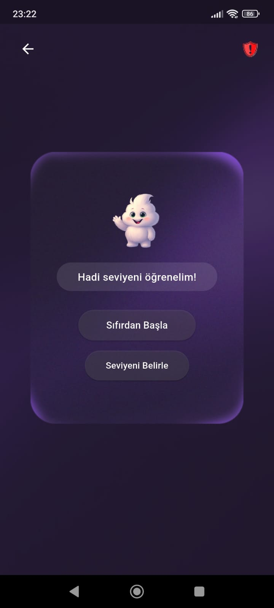

# Takım İsmi
**Bootcamp Grup 95**

---

## Takım Üyeleri

<table>
  <thead>
    <tr>
      <th> </th>
      <th>Name</th>
      <th>Title</th>
      <th>Socials</th>
    </tr>
  </thead>
  <tbody>
    <tr>
      <td></td>
      <td>İbrahim Ateş</td>
      <td>Product Owner</td>
      <td></td>
    </tr>
    <tr>
      <td></td>
      <td>Rabia Altundal</td>
      <td>Scrum Master</td>
      <td></td>
    </tr>
    <tr>
      <td></td>
      <td>Bora Eren Erdem</td>
      <td>Developer</td>
      <td></td>
    </tr>
    <tr>
      <td></td>
      <td>Nevroz Aslan</td>
      <td>Developer</td>
      <td></td>
    </tr>
    <tr>
      <td></td>
      <td>Nuri Alp Mutlu</td>
      <td>Developer</td>
      <td></td>
    </tr>
  </tbody>
</table>

---

## Uygulama İsmi
*Codebite*

---

## Product Backlog URL
[Product Backlog'a buradan ulaşabilirsiniz](https://www.notion.so/21082b3b80e880f8aea3fd648c8885c0?v=21b82b3b80e880ee90be000cad4b371c)

---

## 📱 Uygulama Açıklaması
*CodeBite – Yazılımı Isırık Isırık Öğren!*

CodeBite, yazılıma sıfırdan başlayanlar için özel olarak tasarlanmış, yapay zekâ destekli interaktif bir öğrenme platformudur. Kısa ve anlaşılır görevlerle temelden başlayarak, oyunlaştırma teknikleriyle öğrenme sürecini eğlenceli ve etkili hale getirir. Akıllı yönlendirmeler ve kişiselleştirilmiş içeriklerle herkesin kendi hızında ve seviyesinde ilerlemesini sağlar. Kod yazmayı bir yük değil, bir keşif yolculuğuna dönüştürür.
CodeBite ile yazılım öğrenmek artık daha kolay, eğlenceli ve erişilebilir.

*🎯 Misyon*

CodeBite'ın misyonu, yazılım öğrenimini herkes için erişilebilir, anlaşılır ve keyifli hale getirmektir. Teknolojiyle yeni tanışan bireylerin önündeki karmaşıklık ve korkuyu ortadan kaldırarak, onları güçlü ve motive edici bir öğrenme yolculuğuna çıkarmayı hedefler.

---

## Uygulama Özellikleri:

- 🤖 Yapay Zekâ Destekli İlerleme: Yapay zeka ile seviye belirleme ve seviyene göre oluşturulmuş sorular.

- 🧩 Oyunlaştırılmış Görevler: Öğrenmeyi eğlenceli kılan, seviye seviye ilerleyebileceğin mini görevler.

- 🧠 Temelden Kodlama Dilleri: Algoritmalar, Python, C# ve JavaScript gibi dillerde kolay anlaşılır içerikler.

- 🎯 Kişiselleştirilmiş Öğrenme Yolu: Hedeflerine ve hızına göre şekillenen, tamamen sana özel bir öğrenme deneyimi.

Yazılıma adım atmak hiç bu kadar kolay olmamıştı. *İlk ısırığını al, CodeBite ile kodlamaya başla!*

---

## 🎯 Hedef Kitle

- 15–25 yaş arası öğrenciler
- Yazılıma ilgi duyan ama nereden başlayacağını bilmeyenler
- Eğitim kurumları / Kodlama kulüpleri
- Üniversite hazırlık / lise öğrencileri
- Kariyer değiştirmek isteyen yetişkinler

---

## Daily Scrum

- Sprint içinde tamamlanması tahmin edilen puan: 450 Puan
- Puan tamamlama mantığı: Toplamda proje boyunca tamamlanması gereken 350 puanlık backlog bulunmaktadır. 3 sprint'e bölündüğünde ilk sprint 100, ikinci sprint 200 ve üçüncü sprint 150 olmasına karar verildi.
- Daily Scrum: Bootcamp’in gününden beri günde en az bir kere zaten toplantı yapmakla beraber bu iki haftalık süreçte genelde günde iki toplantı yapıyorduk. İlk toplantıda o gün ne yapacağımızı konuşurken akşamki toplantıya kadar görevlerimizi yapmış oluyorduk. Gün içinde Whatsapp grubumuzdan karşılaştığımız sorunları ve fikir alışverişini yaparken [Notion](https://www.notion.so/Daily-Scrum-21d82b3b80e880cdb404e33998104b38) üzerinden de görev dağılımı ve daily scrum’ın takibini yaptık.
- [Daily Scrum / Sprint 1](https://www.notion.so/Daily-Scrum-21d82b3b80e880cdb404e33998104b38)
- [Daily Scrum / Sprint 2](https://www.notion.so/Daily-Scrum-Sprint2-23382b3b80e8805a9bebdfd8e8b1cd9a?source=copy_link)

---

SPRINT 1

## Sprint Notları:

- İlk sprintte figmadan uygulamanın tasarımının oluşturulması, ‘learning path’ sayfasına kadar da front-end kısmının bitirilmesine karar verildi.

- Proje yönetimi ve zaman çizelgesi için Notion kullanıldı.

- UI ve userflow oluşturmak için Figma kullanıldı.

- Kullanıcı girişi için misaifir girişi oluşturduk.

- Front-End kısmı için flutter kullanmaya karar verdik.

---

# Uygulama Ekran görüntüleri

[Uygulama Ekran Kaydımız](https://youtube.com/shorts/k9HM3KN2m-A)

<table>
  <tr>
    <td align="center">
       
      <b>Açılış Ekranı</b>
    </td>
    <td align="center">
       
      <b>Kayıt Ekranı</b>
    </td>
    <td align="center">
       
      <b>Profil Oluşturma Ekranı</b>
    </td>
    <td align="center">
       
      <b>Giriş Ekranı</b>
    </td>
    <td align="center">
       
      <b>Giriş Ekranı</b>
    </td>
</tr>
</table>

<table>
  <tr>
    <td align="center">
       
      <b>Ders Seçme Ekranı</b>
    </td>
    <td align="center">
       
      <b>Soru Ekranı</b>
    </td>
    <td align="center">
       
      <b>Soruya Yanlış Cevap Verilirse</b>
    </td>
    <td align="center">
       
      <b>Soruya Doğru Cevap Verilirse</b>
    </td>
    <td align="center">
       
      <b>Öğrenme Yolu</b>
    </td>
</tr>
</table>

---
# Sprint Puanları ve Görev Dağılımı

## Sprint Board Güncellemeleri

# Burndown Chart

Puan Tamamlama Mantığı

| #  | Görev                                                                                   | Puan |
|----|------------------------------------------------------------------------------------------|------|
| 1  | Uygulama fikrine karar verilmesi                                                         | 5    |
| 2  | Userflow diyagramının oluşturulması                                                      | 5    |
| 3  | Figma üzerinden ilk tasarımların oluşturulması                                           | 7    |
| 4  | Android Studio veya VS Code kurulumu                                                     | 3    |
| 5  | Front-end tarafında ilk beş sayfanın kodlanması                                          | 15   |
| 6  | Figma tasarımının yenilenmesi                                                            | 5    |
| 7  | Güncellenen tasarımların kodlanması                                                      | 10   |
| 8  | İlk commit işleminin gerçekleştirilmesi                                                  | 2    |
| 9  | Backend ile veritabanı bağlantısının sağlanması                                          | 12   |
| 10 | Uygulama iskeletinin ve yetkilendirme (authentication) yapısının oluşturulması          | 10   |
| 11 | Kayıt ve giriş işlemlerinin yapılması (Register/Login)                                  | 8    |
| 12 | Sprint 1 dokümantasyonunun yazılması                                                     | 4    |
| 13 | Son commitlerin yapılması                                                                | 1    |
| 14 | README dosyasının yazılması ve düzenlenmesi                                              | 3    |

*Toplam:* **100 Puan**

---

---
## Sprint Review

[Figma Sayfamız](https://www.figma.com/design/Z4ecMTd5l7ImfNgZhS8Bgz/codebite?node-id=0-1&p=f&t=E1Le1psq5lt68imt-0)

İlk hafta grup olarak uygulamamızda hangi bölümlerin, hangi sayfaların olması gerektiğine, yapay zekayı hangi kısımda nasıl kullanacağımıza karar verdik.

Konuştuğumuzun kısımları bir userflow diyagramına dönüştürerek oluşturmamız gereken sayfaları adım adım yazdık.

Oluşturduğumuz diyagramdaki düzeni takip ederek sayfa sayfa figma üzerinden ilk tasarımlarımızı oluşturduk.

Aldığımız ortak kararla uygulama ismine CodeBite vererek bu isme uygun maskotumuzu da belirledik.

İkinci hafta Figmadan ilk kısımları oluşturduktan sonra ikiye bölündük. Bora ve Nevroz Figma tasarımlarının devamını yapıp bitirdikten sonra Backend tarafına geçiş yapacakken, İbrahim ve Rabia’nın front-end kısmına başlamasına karar verildi.

Front-end için android studio üzerinden flutter kullanmaya karar verdik.

Tasarımlarımızı ilk halinden şu an kullanılan şık haline getirdik. Oluşan son tasarımın üzerinden de Front-end olarak ilk 10 sayfayı tamamladık.

Codebite uygulamamızı .apk olarak test ettik ve geliştirmemiz gereken taraflarını gözlemledik.

Sprint Review'a Katılanlar: İbrahim Ateş, Rabia Altundal, Bora Eren Erdem, Nevroz Aslan, Nuri Alp Mutlu

## Sprint Retrospective:

Bu sprintte Front-End geliştirme için Android Studio kullanmaya karar verdik. Ancak kurulum süreci tahmin ettiğimizden daha zorluydu. İki haftalık süreçte çeşitli sorunlarla karşılaşsak da, uzun uğraşlar sonunda başarılı bir şekilde kurulumumuzu tamamladık.

Tasarım sürecinde ise, ekip olarak ilk kez kullandığımız Figma'yı oldukça hızlı bir şekilde öğrenip etkin bir şekilde kullanabildik. Kafamızdaki fikirleri somutlaştırmak konusunda bize büyük kolaylık sağladı.

Takım içi iletişim açısından ise; toplantılarımızı verimli geçirmeyi başardık ve birbirimizi eksik olduğumuz noktalarda destekleyerek uyumlu bir şekilde çalıştık.

Yapay zekayı nasıl kullanacağımıza 2.sprintte karar verilecek.

## ---- 1. Sprint Backend Raporu ----

### 1. Sprint Hedefleri

- FastAPI tabanlı bir backend oluşturmak.

- Kullanıcı yönetimi (kayıt, giriş, yetkilendirme) için endpoint’ler geliştirmek.

- Ders ve ilerleme yönetimi için endpoint’ler oluşturmak.

- SQLite veritabanı ile SQLAlchemy entegrasyonunu tamamlamak.

- Admin ve user yetkilendirmesi yapmak.

- Git reposunu temiz ve düzenli bir şekilde yapılandırmak, .gitignore ile gereksiz dosyaları yoksaymak.

- Flutter entegrasyonuna hazırlık yapmak için API’nin temel işlevselliğini tamamlamak.

### 1. Sprint Tamamlanan Hedefler

#### a) Backend Altyapısı:

- requirements dosyası oluşturdu. -> Tamamlandı

- main.py dosyasında FastAPI uygulaması oluşturuldu. Çeşitli ve temel yapılandırmalar yapıldı. Uvicorn kullanıldı. -> Tamamlandı

- SQLite veri tabanı tercih edildi ve codebite.db ile SQLAlchemy ile bağlantı kuruldu. Görüntüleme olarak şimdilik DBeaver kullanıldı. -> Tamamlandı

- Veritabanı bağlantısı ve oturum yönetimi için database.py oluşturuldu. -> Tamamlandı

- models.py dosyasında User, Lesson ve Progress modelleri SQLAlchemy ile tanımlandı ve oluşturuldu. -> Tamamlandı

- schemas.py dosyasında çeşitli API verilerini doğrulamak için Pydantic modelleri (UserRegister, Lesson, Progress, vb.) oluşturuldu. -> Tamamlandı

#### b) API Endpoint’leri:

- Kullanıcı kayıt ve giriş endpointleri geliştirildi. -> Tamamlandı

- JWT tabanlı yetkilendirme (OAuth2) yapıldı ve uygulamanın güvenliği arttırıldı. Bu kısımda schemas.py ve models.py dosyalarındaki classlar ile OAuth2Bearer kısmında sorun çıksa da en sonunda hata bulundu ve fixlenip JWY entegrasyonu başarıyla tamamlandı. -> Tamamlandı

- Admin ve userlar için rol tabanlı yetkilendirme eklendi. -> Tamamlandı

- Ders oluşturma, ders listeleme, ders seçme, kullanıcı derslerini görme ve yetki filtrelemesi yapıldı. -> Tamamlandı

- Progress barları yönetme ve güncelleme yapıldı. -> Tamamlandı

- Admin endpointleri ile user endpointlerine yetki ayrımı ve çeşitli geliştirmeler yapıldı. Admin ve user yetkilendirmelerinde hata alınsa da hata fixlenerek başarıyla tamamlandı. -> Tamamlandı

#### c) Github:

- .gitignore dosyası oluşturuldu ve görüntülenmesi istenmeyen dosyalar gizlendi.

- Dosyalar ayrı ayrı commit edilip her biri için açıklayıcı mesajlar kullanıldı.

- Frontend kısmındaki Flutter ile daha entegre olmadığından ve backend kısmında developerlar olarak daha rahat hareket etmek istenildiğinden main branch yerine master branch'e push edildi. İleride bu branchlerin mergelenmesi planlandı.

**1.Sprint için backend tamamlandı. Flutter entegrasyonu ve backend geliştirme için hazır hale getirildi.**

### 2.Sprint İçin Hedefler:

- Flutter entegrasyonu

- Backend işlemleri detay geliştirme

- Gemini AI entegre ve prompt engineering

- Gemini AI ile kullanıcı seviye tespitine göre AI ile otomatik soru ve oluşturma

- Github'ın düzenli olarak güncellenmesi

  
 SPRINT 2 

## Sprint Notları:

### Bu sprintte gerçekleştirdiğimiz toplantılar, geliştirme süreçleri ve diğer detaylar için [Daily Scrum sayfamızı](https://www.notion.so/Daily-Scrum-Sprint2-23382b3b80e8805a9bebdfd8e8b1cd9a) inceleyebilirsiniz.

- Bu sprintte en önemli hedef, frontend ve backend kısımlarının entegrasyonunun sağlanmasıydı.
- Figmada tasarlanan sayfaların Flutter ile kodlanması tamamlandı.
- Backend tarafında SQLite veritabanı kullanıldı; DBeaver ile veritabanı yönetimi kolaylaştırıldı.
- Kullanıcı yetkilendirme sistemi geliştirildi.
- Seviye belirleme testi için gerekli endpoint’ler oluşturuldu.
- Gemini AI entegrasyonu ile kullanıcının seviyesine göre otomatik soru üretimi sağlandı.
- Dersler bölüm sistemine ayrıldı; her bölüm için ilerleme takibi yapılabilir hâle getirildi.
- Flutter-backend entegrasyonunda yaşanan sorunlar giderildi ve sistem stabil hâle getirildi.

**Backend için Kullanılan Kütüphaneler**

- `fastapi` uygulamanın backend geliştirmesi için kullanıldı.
- `pydantic` ile veri doğrulama ve modelleme işlemleri gerçekleştirildi.
- `bcrypt` ve `passlib` kullanılarak parolalar güvenli bir şekilde şifrelendi.
- `cryptography` kütüphanesi, veri şifreleme işlemleri için projeye entegre edildi.
- `python-jose` kullanılarak JWT ile kimlik doğrulama ve yetkilendirme yapıldı.
- `sqlalchemy` ile veritabanı işlemleri ORM tabanlı olarak gerçekleştirildi.
- `uvicorn`, FastAPI uygulamasını çalıştırmak için sanal sunucu olarak kullanıldı.
- `aiofiles`, asenkron dosya işlemlerini yönetmek için projeye dahil edildi.
- `jinja2` ile HTML şablonları backend'e entegre edilerek dinamik sayfalar oluşturuldu.
- `langchain`, uygulamada LLM tabanlı doğal dil işleme işlemleri için kullanıldı.
- `python-dotenv` ile `.env` dosyasındaki ortam değişkenleri uygulamaya aktarıldı.
- `google-generativeai` kullanılarak Gemini API aracılığıyla yapay zeka cevapları alındı.
- `langchain-google-genai`, LangChain ile Gemini API’nin entegre edilmesini sağladı.
- `markdown`, Gemini’den gelen cevapları HTML formatına dönüştürmek için kullanıldı.
- `bs4 (BeautifulSoup)`, HTML ve XML verilerinden bilgi çekmek için uygulamada yer aldı.
- `starlette`, FastAPI altyapısında kullanılarak HTTP işlemleri desteklendi.
- `python-multipart`, access token içeren form-data isteklerini işlemek için kullanıldı.

----

# Uygulama Ekran görüntüleri

**[Uygulama Ekran Kaydımız](https://www.youtube.com/shorts/1iYmjmZSE4o)**

<table>
  <tr>
    <td align="center">
       
      <b>Profil Ekranı</b>
    </td>
    <td align="center">
       
      <b>Profil Oluşturma Ekranı</b>
    </td>
    <td align="center">
       
      <b>Görev Ekranı</b>
    </td>
        <td align="center">
       
      <b>Streak Sayfası</b>
    </td>
            <td align="center">
       
      <b>Soru Sayfası</b>
    </td>
    
</tr>
</table>

<table>
  <tr>
      <td align="center">
       
      <b>Anasayfa</b>
    </td>
    <td align="center">
       
      <b>Geri Bildirim Ekranı</b>
    </td>
    <td align="center">
       
      <b>Geri Bildirim Teşekkür Sayfası</b>
    </td>
        <td align="center">
       
      <b>Streak Sayfası</b>
    </td>
            <td align="center">
       
      <b>Soru Sayfası</b>
    </td>

</tr>
</table>

---
# Sprint Puanları ve Görev Dağılımı
----
## Sprint Board Güncellemeleri

## Burndown chart

## Puan tamamlama mantığı 200 puan

|  | Görevler | Front-end Puanı | Back-end Puanı |
| --- | --- | --- | --- |
| 1 | Yetkilendirme geliştirmesi |  | 15 |
| 2 | Admin yetkilerinin genişletilmesi |  | 15 |
| 3 | Kullanıcı yetki sınırlamaları |  | 15 |
| 4 | Gemini AI entegrasyonu |  | 20 |
| 5 | Level sistemi oluşturulması |  | 15 |
| 6 | Seviye belirleme testi endpointleri |  | 10 |
| 7 | İlerleme ve soru takibi güncellemeleri |  | 15 |
| 8 | Hata ve geri bildirim paneli |  | 15 |
| 9 | Ders section yapısının oluşturulması |  | 10 |
| 10 | Ders ilerleme barının güncellenmesi |  | 10 |
| 11 | Geri Bildirim ve Teşekkür Sayfaları – Figma tasarımı | 5 |  |
| 12 | Anasayfa ve Günlük Görev Sayfaları – Front-end geliştirmesi | 10 |  |
| 13 | Geri Bildirim ve Teşekkür Sayfaları – Front-end geliştirmesi | 10 |  |
| 14 | Streak Sayfası – Figma tasarımı | 5 |  |
| 15 | Streak Sayfası – Front-end geliştirmesi | 5 |  |
| 16 | Profil ekranının güncellenmesi | 10 |  |
| 17 | Sayfalara navigasyon özelliği eklenmesi | 10 |  |
| 18 | Profil sayasını-Frontend | 5 |  |
|  200| **Toplam Puan** | **70** | **130** |

----

## Sprint Review 

**[Figma Sayfamız Güncellenmiş](https://www.figma.com/design/Z4ecMTd5l7ImfNgZhS8Bgz/codebite?node-id=0-1&p=f&t=E1Le1psq5lt68imt-0)**

**Front-End & UI/UX**

- **Ders ilerlemesi**, kullanıcıların görebileceği şekilde güncellendi.
- **Geri bildirim ve teşekkür sayfalarının** Figma tasarımları yapıldı; ardından front-end kodlaması tamamlanarak back-end ile entegrasyonu sağlandı.
- **Streak sayfasının** Figma tasarımı ve front-end geliştirmesi yapıldı. Back-end entegrasyonu 3. sprintte gerçekleştirilecek.
- Oluşturulan tüm sayfalara **geri tuşu** ve **geri bildirim sayfasına yönlendirme** özelliği eklendi.
- **Profil ekranı**, eklenen yeni özellikler (şifre oluşturma vb.) doğrultusunda güncellendi. "Zaten hesabım var" ve **şifreli giriş** bölümleri eklendi, back-end ile entegrasyonu tamamlandı.
- **Anasayfa** ve **günlük görev sayfalarının** front-end kısmı tamamlandı. (Tasarım çalışmaları bir önceki sprintte yapılmıştı.)

**Backend** 

- Back-end tarafında `models.py`, `schemas.py`, ve `main.py` dosyaları güncellendi. Ayrıca `routers/error.py` dosyası oluşturuldu.
- Yetkilendirme, seviye sistemi, soru üretimi ve section yapısı gibi birçok temel özellik başarıyla geliştirildi.
- Gemini AI entegrasyonu tamamlandı ve kullanıcının seviyesine göre çoktan seçmeli sorular üretilip veritabanına kaydedilebiliyor.
- Seviye belirleme testi için gerekli endpointler eklendi ve test mantığı oturtuldu.
- Kullanıcı ve admin rollerine özel yetkilendirmeler genişletildi.
- Hata bildirim sistemi geliştirildi ve kullanıcı geri bildirimleri tarih-saat ile kayıt altına alınmaya başlandı.
- Section yapısı oluşturularak derslerin parçalı takibi sağlandı.
- Flutter ile backend entegrasyonuna başlandı. Login ve token işlemlerinde yaşanan hatalar çözüldü, sistem daha stabil hale getirildi.
- Github üzerinden düzenli commit ve versiyon kontrolü yapıldı.

Sprint Review'a Katılanlar: İbrahim Ateş, Rabia Altundal, Bora Eren Erdem, Nevroz Aslan, Nuri Alp Mutlu

----

### Sprint Retrospective
- Bu sprintte bizi en çok zorlayan kısım, **frontend ile backend entegrasyonunu sağlamak** oldu. Özellikle **Flutter’daki SDK ve NDK yapılandırmaları**, geliştirme sürecinde birçok teknik sorun çıkardı ve önemli ölçüde zaman kaybına yol açtı.

- 2.Sprint boyunca en çok emek harcadığımız alan bu oldu ve 3. Sprintte de en çok zaman ayırmamız gereken kısım olacağı öngörülüyor.

- Bunlara ek olarak 2.sprintte takım içi iletişimde bazı zorluklarla karşılaştık.

- Ekip üyelerimizden üçünün stajlarına başlaması, günlük iş yoğunluğunun artması ve teknik problemlerle uğraşmak zorunda kalmamız, ekip içi koordinasyonu zaman zaman zorlaştırdı.

- Ancak tüm bu koşullara rağmen, ekip olarak iletişimimizi sürdürerek görevlerimizi tamamlamaya odaklandık ve motivasyonumuzu yüksek tutmaya gayret ettik. Bu süreç, zaman yönetimi açısından da bize önemli bir deneyim kazandırdı.

---
## --- 2. Sprint Backend Raporu ----

### 2.Sprint Hedefleri

- Backend kısmındaki yetkilendirme ve yönlendirme kısımlarının geliştirilmesi.
- Adminler için daha esnek ve geniş yetkilendirmeler yapmak.
- Kullanıcılar için daha fazla seçenek ve yetki sınırlaması yapmak.
- Gemini AI entegrasyonu ile database'e belirli derslerle ilgili soru generate etmek.
- Sorular ve kullanıcılar için level sistemi eklemek.
- Seviye belirleme testi için gerekli endpointleri geliştirmek.
- Dersler için gerekli ilerlemeleri ve soruların takip edilmesi için gerekli güncellemeler ve eklemeler.
- Hata ve geri bildirim için panel eklenmesi.
- Derlerin sectionları için ayrı yapı oluşturma.

### 2.Sprint Tamamlanan Hedefler

### a) Backend Altyapısı:

- routers/auth.py dosyasına yetkilendirme kısımları güncellendi. -> Tamamlandı
- routers/auth.py dosyası için admin ve user ayrımı yapılması ve hataların güncellenmesi. -> Tamamlandı
- routers/auth.py dosyası için admin yetkilerinin esnetilmesi ve genişletilmesi, user kısımlarının ise yeni sınırlamalar getirilmesi. -> Tamamlandı
- JWT Token mantığı güncellendi. Bu kısımda hatalarla ve düzeltmelerle uğraşıldı ancak sonunda düzeltildi. -> Tamamlandı
- [models.py](http://models.py/) dosyasına yeni modeller eklendi ve var olan modeller güncellendi. Yeni özellikler eklendi ve modeller arası ilişkiler kuruldu. (many-to-many, one-to-many) -> Tamamlandı
- [models.py](http://models.py/) dosyasına derslerin konuları için Section sınıfı eklendi. -> Tamamlandı
- [main.py](http://main.py/) dosyası güncellendi ve gereksiz özellikler çıkarıldı. Sadece denemek için shortcut endpointleri eklendi. (sonradan kaldırılacak) -> Tamamlandı
- [schemas.py](http://schemas.py/) dosyası güncellendi ve yeni eklemeler yapıldı. [models.py](http://models.py/) dosyasına göre gerekli şemalar oluşturuldu. -> Tamamlandı
- routers/error.py dosyası eklendi. Adminler ve kullanıcılar için yetkilendirme işlemleri yapıldı. Kullanıcıların raporlama sisteminin geri bildirimini database'e tarih ve saat olarakta kaydetmesi sağlandı. -> Tamamlandı
- routers/lesson.py dosyasına derslerle ilgili çeşitli işlemler ve eklemeler yapıldı. Önceki 1.sprintte yer alan hatalar fixlendi. Yeni pydantic sınıfları eklendi. -> Tamamlandı
- routers/lesson.py dosyasına soru generate için Gemini AI endpointi eklendi ve prompt engineering yapıldı. Bu kısımda belli başlı kısıtlamalara takınılsa da sonunda optimize hale getirildi. Artık database'e kullanıcının leveline, aldığı derse ve dersin kategorisine göre çoktan seçmeli olarak soru generate edilebiliyor ve doğru cevapları da database'e kaydediyor. -> Tamamlandı
- routers/lesson.py dosyasına sadece adminler için ders silme endpointi eklendi. -> Tamamlandı
- routers/lesson.py dosyasına seviye belirleme testi olan level test endpointi eklendi ve hatalar fixlendi. Ayrıca bu kısım için geçici olarak tutulan sorular kalıcı hale getirildi ve prompt tekrar gözden geçirildi. Kullanıcıların doğru sayısına göre level sistemi atama tanımlandı. -> Tamamlandı
- routers/lesson.py dosyasındaki level test submit kısmı eklendi. Admin ve user yetkileri güncellendi ve seviye belirleme testine giren kullanıcıların girip girmediğinin kontrolü yapılması sağlandı. -> Tamamlandı
- routers/lesson.py dosyasına frontend'in backend kısmından soru alabilmesi için question response modeli eklendi. -> Tamamlandı
- routers/lesson.py dosyasına kullanıcının seçilen dersin sectionlarını görebilmesi için endpoint eklendi. -> Tamamlandı
- routers/lesson.py dosyasına sectionların sadece adminler tarafından oluşturulabilmesi için endpoint eklendi. -> Tamamlandı
- routers/lesson.py dosyasına sectionların sistemi oluşturuldu. Dersler için birden fazla section desteği sağlandı. Her section, kendi içinde total_parts (varsayılan 3) ile ilerleme takibi yapıldı. Section ilerlemesi 3/3 olursa bir sonraki sectiona geçilmesi sağlandı. -> Tamamlandı
- routers/lesson.py dosyasına userların section ilerlemesini gösterebilmesi için endpoint eklendi. -> Tamamlandı.

Backend kısmında hala belirli eksiklikler ve eklenmesi gereken kısımlar var. Duruma göre güncellenmesi de gerekebilir. Şu anlık genel olarak backend kısmı yeterli ve çalışıyor. Ancak geliştirilmesi gerekiyor.

### b) Flutter ve Backend Entegrasyonu:

- Flutter ve Backend kısımlarının entegrasyonunda çok fazla hata yaşandı. Özellikle login ve token kısmında flutterdaki shared_preferences kaynaklı sorunlar çözüldü. Sistem daha stabil hale getirildi. -> Tamamlandı
- Flutter kısmına zaten hesabım var kısmı eklendi. -> Tamamlandı
- Profil oluşturma entegre edildi. -> Tamamlandı

Flutter kısmında hala belirli sıkıntılar var. Özellikle backend ile entegrasyonunda sorun çıkabiliyor. Bunların çözülmesi lazım.

### c) Github:

- Düzenli olarak master branche güncellemeler ve eklemeler açıklayıcı commitlerle push edildi.

*2.Sprint için backend tamamlandı. Flutter kısmıyla entegrasyon yapılmaya başlandı. Uygulamanın canlıya çıkmasına yaklaşıldı.*

---

### 3.Sprint İçin Hedefler:

- Uygulamanın reklam stratejisi belirlenecek.
- Yayın kanalı seçildikten sonra uygun içerikler hazırlanacak.
- Uygulamanın tanıtım videosu oluşturulacak.
- Eksik özellikler tamamlanarak uygulama canlıya alınacak.
- Flutter ve backend entegrasyonu eksiksiz ve sorunsuz şekilde gerçekleştirilecek.
- Backend, tamamlanmış haliyle test edilecek.
- Uygulama mağazası açıklamaları ve görselleri hazırlanacak.
- Gerekli tüm geliştirmeler tamamlandıktan sonra uygulama yayına alınıcak.
- Kullanıcı deneyimi (UX) testleri gerçekleştirilecek.
- Geri bildirim toplama mekanizması (feedback flow) iyileştirilecek.
- Versiyonlama ve sürüm takibi için dökümantasyon güncellenecek.
- Uygulama güvenliği test edilerek varsa açıklar kapatılacak.
- Admin girişi yapıp giriş sonrası alınan JWT token ile yetkili işlemler, 4 dersi oluşturup swagger UI üzerinden endpoint ile dersler eklenip 3 farklı zorluk seviyesinde soru ürettirilicek.

